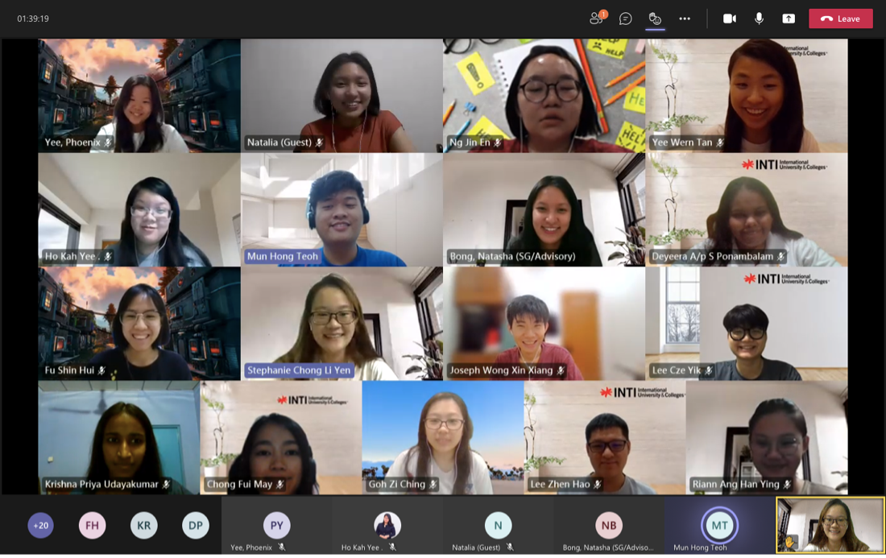
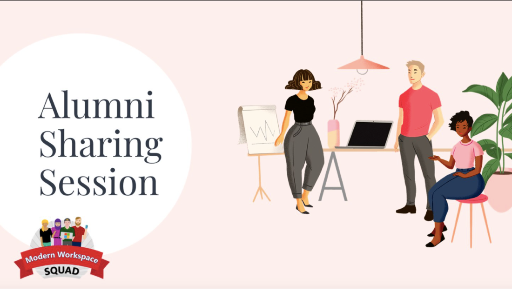
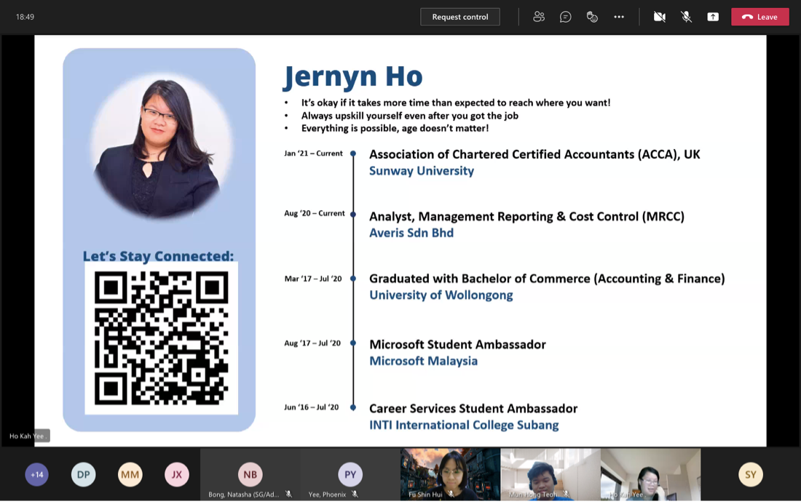
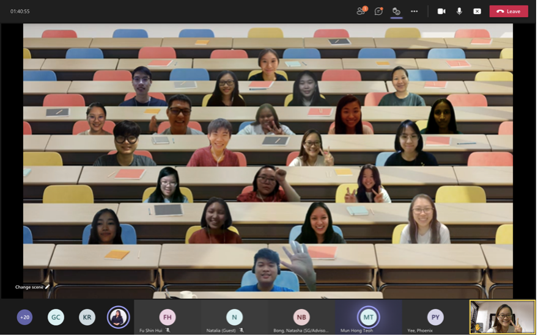

On 14 May 2021, Modern Workplace Squad has organized the very first **Alumni Sharing Session**. This sharing session was held from 8 pm to 9.30 pm on the topic of **“The transition from college graduates to working adults”**.  

<!--truncate-->

The Alumni speakers include **Natalia Bong** who is a Senior Analyst, Strategy, and Planning at Lazada, **Natasha Bong** who is working at KPMG as a Finance, Operations and Technology Associate, **Jernyn Ho** who is an Analyst at Averis, **Phoenix** who is a Business Development Representative at Software One and **Teoh Mun Hong** who work as an Adoption Specialist at Microsoft.

There was a total of 25 participants including the staff and our fellow friends from INTI Career Service across campuses including Subang, Nilai, and Sabah.

The sharing session was started by **Jernyn Ho**:

> Life never goes as planned as it is never an x-axis or y-axis but always a bell-shaped.

She also shared her real-life plan which was to pursue ACCA right after she graduated from INTI college, but instead she got a job offer which has put her ACCA exams on hold. It is true that life does not go as plan, therefore, we should not give up or be upset when things do not go our way but instead, we should take this as an opportunity to grow and learn.

Next, **Phoenix** quoted during the session:

> We should not be afraid to fail, grab the opportunity, or miss it. Opportunities only come once, if we do not be brave and take them, they will be gone in a blink of an eye.

**Sometimes, taking a leap of faith is what we needed!**

**Natalia** also said:

> In times of adversity, adapt, tweak, adjust. We should not be stressed out when we are in hardship. This is because opportunities to find our deeper powers come when life seems most challenging.

Lastly, **Natasha** claimed:

> We should be firm but not harsh on ourselves. Sometimes without realizing we might put too much pressure on ourselves which may cause us mental and physical pain. Therefore, being firm means that we should learn to stay cool and calm when expressing ourselves. Remember to breathe normally and be present.

Throughout their interactions with the audience, we can clearly see that they have many experiences and knowledge to share. Furthermore, they advised the participants who were on their journey to a working life that skills such as communication and presentation skills, confidence, connections, and courage to talk to authorities will benefit them in the future.

Although this session was only 1 hour and 30 minutes long, the participants were awed and inspired by the sharing. Everyone is very excited about the next sharing session! 🎉
