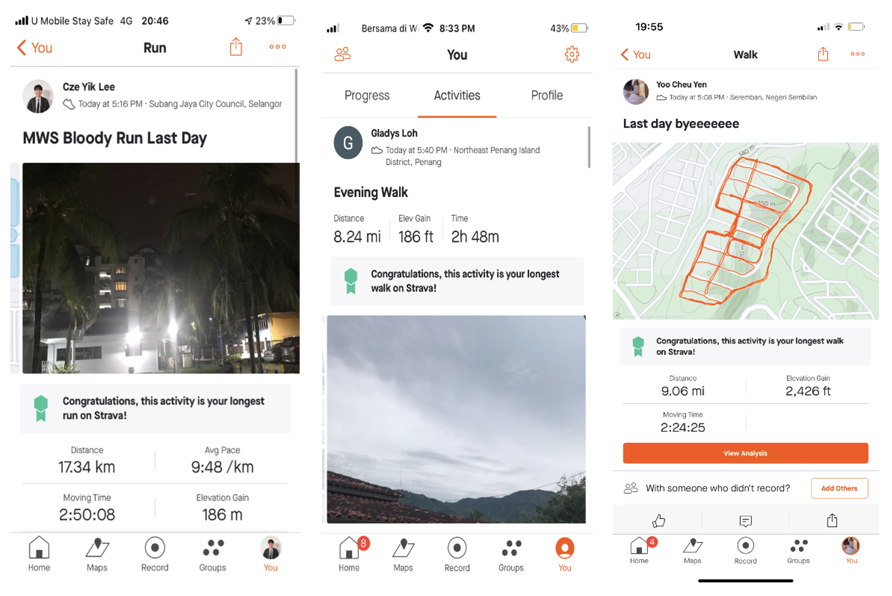

Modern Workplace Squad has organized a virtual run event from 7th June 2021 to 13rd June 2021. This virtual run was called “Bloody Run".

<!--truncate-->

Our squad leader, **Stephanie Chong** believes that the human body needs good blood circulation as it supplies the body’s vital organs with enough oxygen and nutrients, and the easier way to do it is by encouraging members to jog, walk or run to improve cardiovascular fitness and stay active without the gym! The great news is that most of the participants are actively motivated by this challenge and manage to hit a total of 21 participants joining the event.

During the course of 2 weeks, participants are required to run at least 4 days a week with a minimum of 2 KM distances. To make this event more efficient and precise, participants are required to track their progress by using an application called Strava. This application allows participants to record their time, date, and distance and send screenshots of their progress to the Microsoft Teams group chat and record manually in the Excel sheet provided. The participants are also encouraged to post their progress in their Instagram stories and tag **@microsoft_mws**.

Most ambassadors are studying and working remotely, they are often cooped up at home. With this event, they are encouraged to go out and appreciate the surroundings and nature. The aim of the Bloody Run challenge is to encourage members to practice a healthy lifestyle as walking or jogging plays the biggest factor in how many calories we burn while increasing stamina naturally. The idea of staying at home may be deemed to be unhealthy, this is the chance for members to grasped practicing a healthy lifestyle together vicariously.

The participants with the furthest distance will win prizes. The champion will win RM60, the first runner-up will win RM45, and the second runner-up will win RM30. These cash prizes will be given to the winners via Touch n’ Go e-wallet.

At the end of week 2, we have our winner.

| Name         | Distance (KM) |
| ------------ | ------------- |
| Lee Cze Yik  | 74.19         |
| Gladys Goh   | 70.8          |
| Yoo Cheu Yen | 59.2          |

Screenshots taken by the winners.

