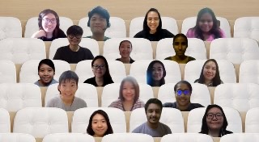
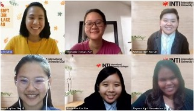
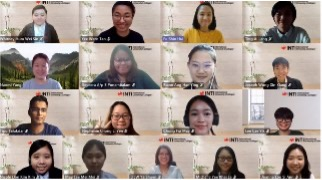

A lot of things happend on 3rd, 4th, and 9th July 2021. We have 11 new babies joining the squad! 🥳 Let's listen to what they say before deciding to join us.

<!--truncate-->

## Things that happened on 3rd and 4th July 2021

On the 3rd and 4th July 2021, Modern Workplace Squad had organized a 2-day Bootcamp to recruit new Modern Workplace Members. During this 2-day bootcamp, it was packed with the training of Office 365 application. We would like to thank the trainers and facilitators for their hard work to make this event a success.

- Sihan Rainudeen Tuan Harith (Microsoft Word)
- Gladys Loh Xiao Shan (OneDrive)
- Tee Jye Yie (Excel)
- Ng Jin Ern (One Note)
- Evelyn Cheah Sze Yin (Microsoft Team)
- Fu Shin Hui (Outlook)
- Yoo Cheu Yen (Timekeeper)
- Lee Cze Yik (Chat keeper)
- Veishnawi A/p Nehru (Moderator)

Modern Workplace Squad also organized a short Kahoot session to engage with the participants. All the participants joined the Kahoot session and had lots of fun. Group photos had been taken to remember this fruitful day.

There was a total of 27 participants.

## Things that happened on 9th July 2021

On the 9th July 2021, Modern Workplace Squad had organized an Assessment day. The participants are required to present the Microsoft Applications of their choice. The session was started by Miss Naomi, the vice president of career services. She gave a short talk on the history of the squad and her experiences with Modern Workplace Squad.

The judges were Teoh Mun Hong from Microsoft and Miss Uma from INTI Subang. There were total of 11 participants who registered for the bootcamp. The participants are placed into 2 groups which are Alpha and Beta.

The participants delivered their presentations with confidence and with an interesting story line. Mun Hong and Miss Uma gave their feedbacks and comments to the participants. They also questioned the participants on their expectations and contribution to the squad.

The assessment lasted for 2 hours and the judges finally selected all the 11 participants as the official Modern Workplace Squad members. Let’s Welcome the new members of the squad:

- Deyeera A/p S Ponambalam
- Tipu Talukdar
- Nicole Lian Kim Kim
- Riann Ang Han Ying
- Whitney Hum Wei Sin
- May Lee Mei Mei
- Joanne Loo Si Ann
- Liew Ya Shuen
- Ting Ai Leng
- Joseph Wong Xin Xiang
- Michelle Yee Khai Le

### The top 3 presenters

- Michelle Yee Khai Le
- Joseph Wong Xin Xiang
- Ting Ai Leng

The judges and squad leaders congratulated the new members and encourage them to get exposure in Modern Workplace Squad.

### Why decided to join MWS?

Let’s have a look on why the members decided to join MWS.

#### Deyeera A/p S Ponambalam

> I joined MSW because I want to expand my knowledge on the Microsoft applications and at the same time, I want to share those knowledge and tips I've learnt with others.

#### Nicole Lian Kim Kim

> I joined MWS so that I can learn more about the software and teach my fellow peers from design backgrounds on how to utilize and combine Microsoft Office 365 with their knowledge on Adobe software.

#### Riann Ang Han Ying

> The reason for joining the MWS is because I am passionate about learning and exploring to be a better me. Besides, I have joined a few sharing sessions that were conducted by MWS, I am so impressed by the presentation skill and Microsoft technique that the members had brought to us. I wish that I could enhance my Microsoft skills and have better personal development as well as share the importance of Microsoft applications to the public by joining the MWS family!

#### Whitney Hum Wei Sin

> I saw MWS as an opportunity for me to gain new skills and more exposure. Basically, it seems like a great way to discipline myself with more responsibilities that benefit me and others.

#### May Lee Mei Mei

> I want to step out of my comfort zone and I believe that it can provide me the opportunity to improve myself and develop skills such as leadership and communication skills.

#### Joanne Loo Si Ann

> I decided to join MWS because I would like to take this opportunity to develop more non-academic skills and build up my self-confidence so I’m able to present myself better.

#### Liew Ya Shuen

> I would like to learn communication skill.

#### Ting Ai Leng

> I join to learn using Microsoft apps and improve soft skills.

#### Joseph Wong Xin Xiang

> I joined MWS to build my social networks. In the 21st century, I believe we can't do anything without connections. Think about it, we need customers & colleagues in order to work effectively. Together everyone achieves more (TEAM).

#### Michelle Yee Khai Le

> Hello I am Michelle, a final year student majoring in Accounting and Finance in collaboration with University of Hertfordshire. What intrigued me to be a Microsoft Workplace Squad’s Student Ambassador was how we as students are given the opportunity to take on interesting roles that can greatly build our character as well our soft skills through the planning of events as well as when educating the students and lecturers on ways to navigate Microsoft Office 365. I believe that by becoming a Microsoft Student Ambassador, I can thrive greatly.
