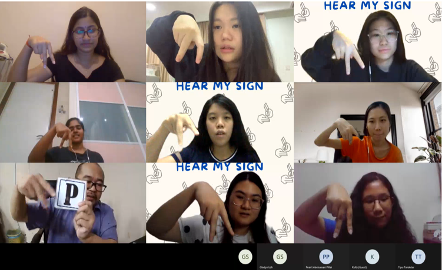
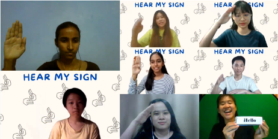
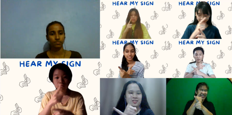
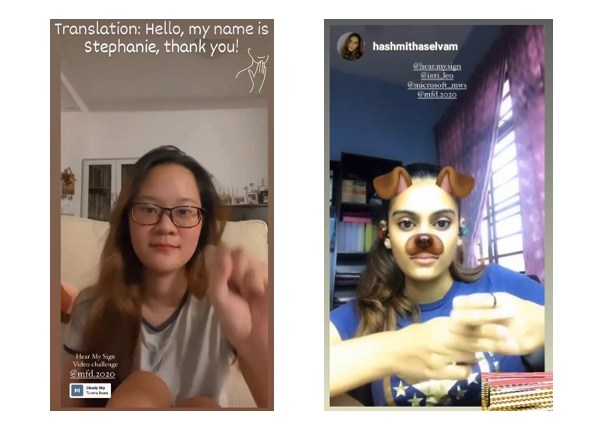

On the 08th of July 2021 from 5 to 7pm, we organized a wonderful awareness event called **“Hear My Sign”** together with **Leo Club Inti IU**. This event collaborated with the **Malaysian Federation of the Deaf (MFD)**. 

MFD, founded on 8th of December 1997, aims to unite all Deaf related organizations in Malaysia in order to work together to fight for the rights and needs of the Deaf and to secure an equal opportunity in the society for the deaf and hard of hearing.

<!--truncate-->

## Opening

Firstly, this event was done with the opening with the organizing committee, which is by the Leo Club, and followed by the organizing committee which is Microsoft Modern Workplace Squad. Then, the opening session was taken over by Mr. Sazali and was translated by Mrs. Zuraidah. 

Mr. Sazali shared his thoughts and experience by creating closure with the participants by “Understanding deaf person and communication”. He shared the details of daily experience of a deaf person such as lip reading and breaking the stereotype, as he is one of them which clearly demonstrated his enthusiasm in creating deaf awareness towards the youth especially the students. As he mentioned that every person in this world should be “integrated and inclusion in this society with harmony and not feeling neglected”.

## Sign Language Lessons

After Mr. Sazali’s great speech, it was time for sign language lessons. Thankfully for MDF who provided us with 5 great trainers (Helen Lee, Chai Xin, Nur Saadah, Zaine Bujal, and Aliza Mamat). Not only were they proficient in sign language, but they also managed to create a learning atmosphere where all the students felt comfortable and learned the basics of sign language quickly. Moreover, the students were excited to learn the new language even though it was done online which shows how motivated they were to learn for the betterment of self and society. The student’s passions drive them to spread awareness more towards society. 

## Photos taken during lessons

During the lessons, students were learning about characters such as P and R, and they also learned sign language for word!

## “Hear My Sign” Video Challenge

The challenge is to create a short recording with sign language and then either share it on your story on Instagram and tag us (Inti LEO, MWS, Hear My Sign) and MFD or share the video to **“Hear My Sign”** on Instagram. This allows us to promote deaf awareness towards the public, especially the youth such as students. This has inspired me to create the challenge of **“Hear My Sign”** that has been conducted in social media which is Instagram.

Though **Hear My Sign** is only a 2-hour long event, it is very meaningful for each and every one who attended the event. At the end, all that matters is that we did our part to raise awareness and learnt something we did not know before. 