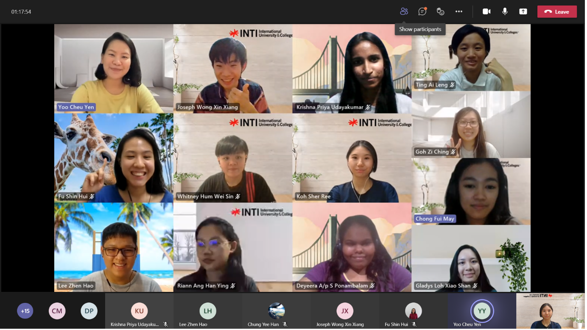

On 31st of July 2021, **Social Media Program (SMP)** leaders, Yoo Cheu Yen and Koh Sher Ree had organized a meetup with Modern Workplace Squad members. In this meeting, they get to know each other and introduce the structure of SMP to the newcomers.

<!--truncate-->

The session started with a game of Scribble via the platform Gartic.io. The members are required to click into the link to join this game. Scribble is a game where one of the players will draw and the others will have to guess what the members are drawing. The game lasted for 30 minutes, and all the members participated and had a blast.

The session proceeds with thanking the senior SMP Leader, Lee Zhen Hao and Vice Leader Evelyn Cheah Sze Yin for their effort and time to make SMP a success. During their speech, Zhen Hao fondly reminisced his memories of joining the squad and all the activities he did. He also gave advice to the current members and leaders to always be cooperative and join the events organized. Meanwhile, Evelyn also reminisced on her favorite moment in Modern Workplace Squad which was brainstorming with the current leaders until midnight. She also mentioned that she likes to share ideas and think of stuffs that are out of the box.

Following that, the session continued by introducing the new SMP leaders which are Yoo Cheu Yen who oversee Content Creation and Koh Sher Ree who are in charge of the Marketing side. Cheu Yen mentioned that SMP had planned many upcoming activities and hope the members will give their full support. Meanwhile, Sher Ree said that even though Cheu Yen and she have different responsibilities, but they work closely together.

The SMP leaders also explained the objectives which are:

1. To equip members with designing, writing, and soft skills
2. To bring member together by encouraging collaboration and teamwork
3. To create awareness on social media

They also explained the SMP structure thoroughly and revealed the upcoming events.

Moreover, the Tech Team Leader, Chung Yee Han also gave a short speech and had a short sharing session with the members on GitHub, and the current website of Modern Workplace Squad.

Before the session ended, we took a group photo to remember this event, Overall, all the members had fun and enjoyed the session.
