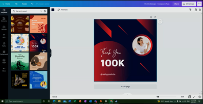
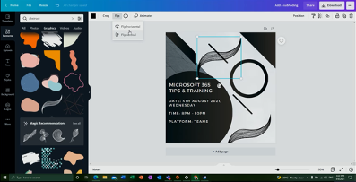
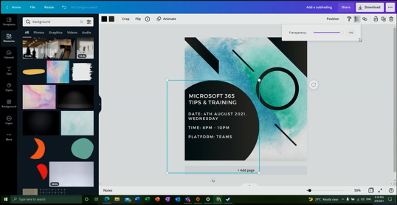
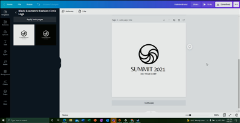
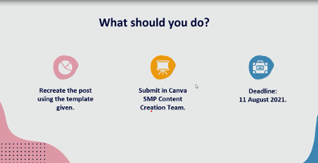

The Canva workshop was held on 4th August 2021. It was conducted by none other than Evelyn Cheah Sze Yin, who was our alumni and one of the squad leaders in 2020.

<!--truncate-->

On 4th August 2021, the Modern Workplace Squad organized a Canva Workshop to equip our Modern Workplace Squad ambassadors with designing skills. This workshop session was held from 8 pm to 9.30 pm. It was conducted by none other than Evelyn Cheah Sze Yin, who was our alumni and one of the squad leaders in 2020.

Despite her busy schedule, she managed to  squeeze out her time to teach the Modern Workplace Squad members on how to create a fantastic posters.

She began the workshop by briefly introducing the purpose of Canva. It is mainly for anyone including beginners to create simple graphic designs. Firstly, she demonstrated some useful and creative templates provided by Canva and how we can apply our preferred design styles on existing templates. 

The main focus of the training is on creating Instagram posts using Canva. Evelyn showed us how to modify fonts and texts in existing templates to create posters for Instagram. Using the professional poster template above as an example, she transformed it into something looking quite unique and cool.

It was interesting to see how she created a different design from the existing template using tools in Canva to change transparency of the poster, flipping object orientation and dragging the elements given to use as the poster background.  

Since there was more than enough time, Evelyn showed everyone additional features in Canva such as creating logos and newsletter covers which can be useful for everyone in the future.

Afterwards, she unveiled the social media design template for our Modern Workplace Squad Instagram page. This template contains guidelines for members to follow and help them in creating upcoming event and productivity posts.  

Finally, our social media program (SMP) team leaders Yoo Cheu Yen and Koh Sher Ree assigned all attending squad members a task to complete in pairs so that our members can practice what they have learnt from Evelyn. Besides that, their posters will also be posted into our official Instagram account @microsoft_mws. The leaders gave clear and precise instructions to the members before the members proceed to create their masterpiece. Since the pairing is randomize, the members will also get a chance to meet new friends. Besides that, the members were given 1 week to complete their posters.

Although this workshop session was only 1 hour and 30 minutes long, the participants were exposed to many useful insightful tips in using Canva more efficiently. Furthermore, there were 24 participants who joined this workshop. Our squad members are very excited, and they look forward to more training workshops from our alumni and experienced squad members.