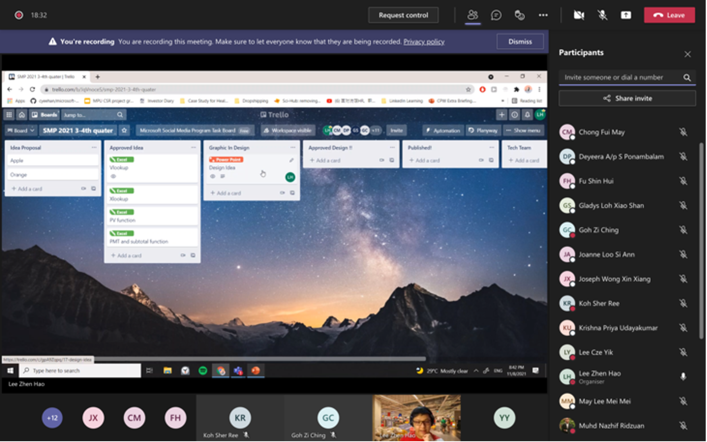
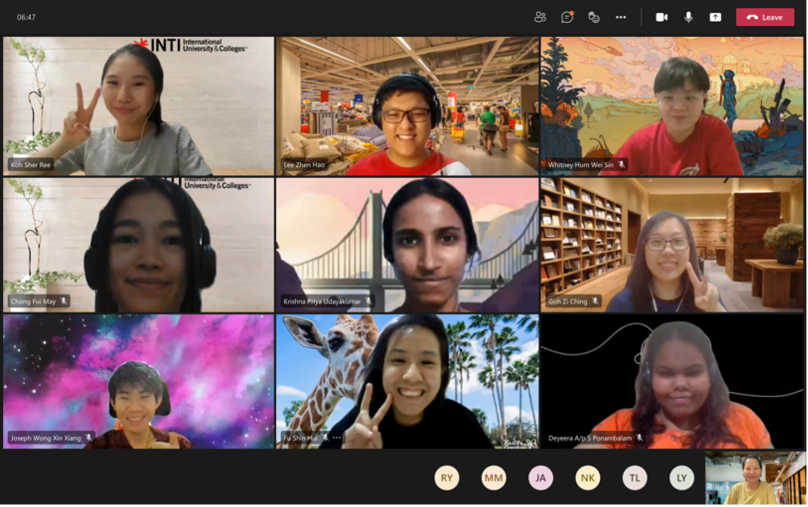

The session was led by Lee Zhen Hao, who led the Social Media Program in the previous quarter and assisted by Goh Zi Ching, who led the Squad in the previous quarter.

<!--truncate-->

To prepare the Modern Workplace Squad members for using this particular application, the squad hosted a Trello workshop on 11th August 2021. The workshop session took place from 8.30 pm to 10 pm. The session was led by Lee Zhen Hao, who led the Social Media Program in the previous quarter and assisted by Goh Zi Ching, who led the Squad in the previous quarter.

After the introduction, Zhen Hao briefly explained Trello's purpose, which included simplifying workflow and letting participants keep track of each other's progress as well as notify members. Furthermore, he also explained how the squad member can access the Modern Workplace Squad Trello board. As soon as the participant joined Trello via the link provided by Zhen Hao, he expounded on the flow and process of content creation. His explanation allowed the participant to understand in a very short time.

He then invited the participants to explore and learn how to add, delete, and join cards. Before passing the session to Zi Ching, he emphasized how each squad member could use Trello.

Zi Ching then shared the website of Microsoft Support where everyone could locate their ideas on content creation. Additionally, she gave a step-by-step demonstration of the content creation process from beginning to end. Under Zi Ching's guidance, the members also get to try out the majority of the functions.

At the end of the session, each member gets to upload the masterpiece that they have created using Canva and update the Trello board. Both Zi Ching and Zhen Hao offered their full support and guidance throughout this process. Overall, it was a very good workshop given by the senior.

Despite its short length, this workshop provided participants with an overview of all the necessary functions. This workshop had a total of 17 attendees, and everyone is pleased with what they learned.

