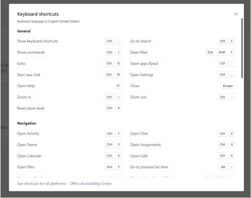
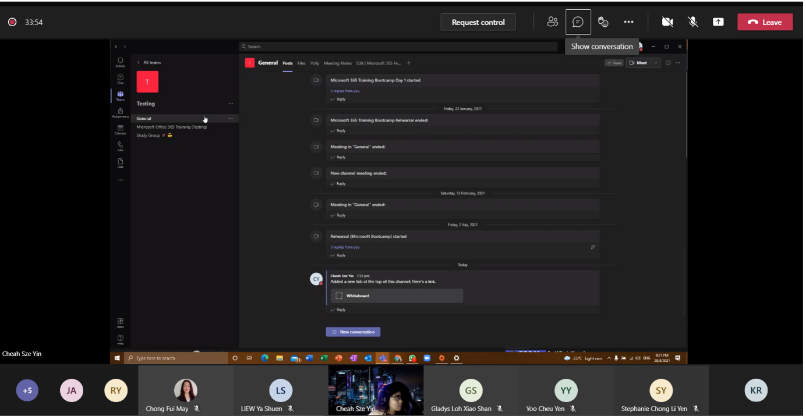
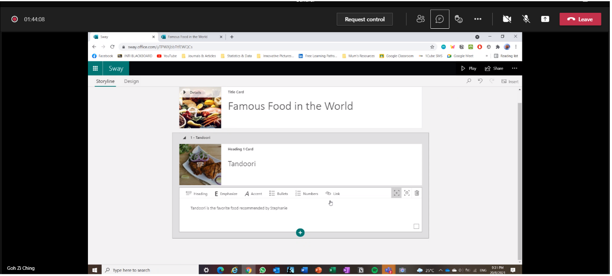
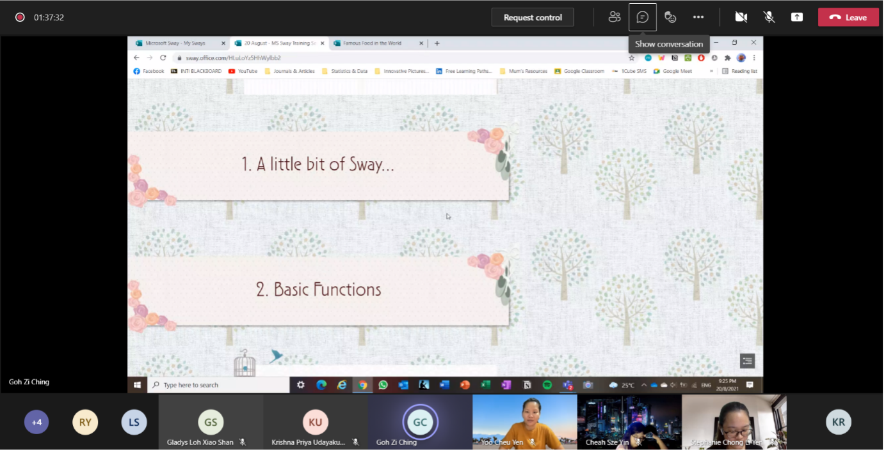

On the 20th of August 2021, **Modern Workplace Squad** had organized an internal training for the members. This internal training aims to equip members with more knowledge on the Microsoft applications. In this session, the applications that will be taught are Microsoft Teams, intermediate level by **Evelyn Cheah Sze Yin** and Sway, beginner level by **Goh Zi Ching**.

<!--truncate-->

At 8pm, the session stared with a warm welcome by our squad leaders. The squad leaders hope that with this internal training, the members will be able to learn new tips and tricks and also to be able to become a trainer for one of the workshops. Following that, the training for Microsoft Teams began.

In the beginning, Evelyn showed the members some basic functions. She also introduced to us some new functions such as whiteboard and meeting note. Meeting note is used for writing down some notes right here in Microsoft Teams. With whiteboard, we can demonstrate things to the audience. Another fun way to utilize whiteboard is by playing games such as Scribble. One of the tips in Teams that amaze the audience was the keyboard shortcuts. By clicking “Ctrl +.” we can access all the keyboard shortcut that can help make our work faster and more efficient.

Before ending her session, Evelyn told the members that Microsoft Teams is very special because this is where all applications in Microsoft 365 collaborate and we can have access to Words, Excel, PowerPoint and many more right here in Teams.

The session was continued by Goh Zi Ching with the application Sway. Microsoft Sway is a presentation software and it allows users to combine text and media to create a presentation, newsletter and many more. Sway is also a useful alternative to PowerPoint.

Zi Ching started her session by creating a blank sway and the topic is ‘Famous Food in The World”. Everyone was astonished by Sway because it is very easy to use. She taught the members on how to add backgrounds, add text, media, heading and many more. The purpose of this workshop from Zi Ching is to create future tips and tricks posters for Modern Workplace Squad social medias and to recruit new writers for our monthly newsletter. If you are interested in tips and tricks poster do check out our [Instagram](https://www.instagram.com/microsoft_mws/), and if you wanna see our [monthly newsletter](http://localhost:3000/docs/newsletters/august-2021).

“I used Sway for my presentation last semester, the lecturer was very impressed! Pay attention if you wanna score on presentation” – said Yoo Cheu Yen who is one of our ambassadors.

“This Sway reminds me of those advertisements”- said one of our ambassadors.

“It amazes me on how easy it is to use Sway, like I can just drag the pictures, add links and text!” – exclaimed one of our ambassadors.

Besides that, there are also many ready-made designs in Sway, and we can also customize our very own design, adjust the font, animation and reading style such as slide show, vertically or horizontally.

The session ended at 10PM and everyone is very happy with what they had learnt that day. The trainers were very clear on what they are presenting, and they were very engaging with the members. It is no doubt that everyone is looking forward for the next internal training.
