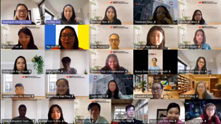
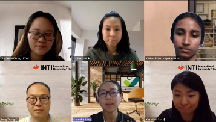
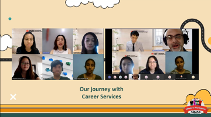
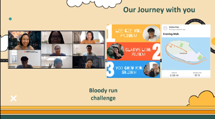
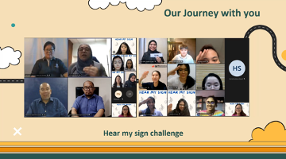
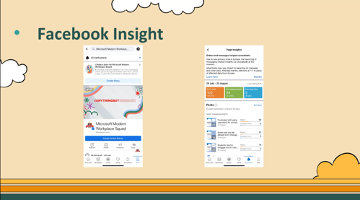
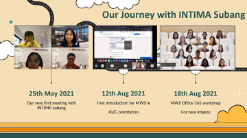
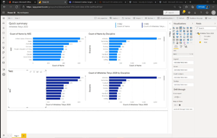

On 27th August 2021, Modern Workplace Squad had a very special Appreciation Day. It was held to commemorate our collaboration with Microsoft, INTI Career Services, INTIMA and appreciate all squad members for their cooperation and effort in making all our events and initiatives successful. It was held from 1pm to 2pm. Afterwards, a short one-hour training on Power BI was conducted for our squad members.  

<!--truncate-->

This event begun with an opening speech by Casandra Seng, Business Group Lead of Microsoft Modern Workplace. She expressed her gratitude towards all the amazing contributions from our squad and encouraged us to keep contributing and make more achievements together.

Next, we walked down the memory lane to look at our squad’s achievements and milestones within the past quarter 🎉

Firstly, we reflected on our collaboration with INTI Career Services team. In July, we organized a training bootcamp session for INTI Career Services Student Ambassador who are interested in joining our squad.

Within the next few days in the same week, our squad is honored to provide Career Services staff with an Excel Training. Our INTI Subang squad leader, Stephanie Chong thanked Tee Jye Yie, our trainer and the team for making it a success despite having a short preparation time.

Besides, we had some quite awesome special events in our squad.

Firstly, we had our very first Alumni Sharing Session in May. We are honored to invite 4 of our excellent squad alumni to share their past experiences to encourage our current and potential members.

Other than that, our members had fun participating in June’s Bloody Run Challenge. In the process, everyone managed to get some healthy exercise while having fun competing.

Furthermore, to welcome our 11 new squad members from July’s Recruitment Session, we had an Onboarding Session and had tons of fun playing 2 Truths 1 Lie. From this, we get to know each other better and introduce the newcomers to their responsibilities as our squad members.

Then, in the same month, we collaborated with INTI IU Leo Club to organize Hear My Sign event to raise awareness and learn about basic sign language. We had a Hear My Sign Challenge in which about 80 participants took part. Initially, it was challenging to communicate with the trainers from Malaysian Federation Of The Deaf (MFD) without speaking. Overall, it was fun and interesting.

For our Social Media Program (SMP), our leaders Yoo Cheu Yen and Koh Sher Ree appreciated all members for creating content to post in our social media platforms. Then, Cheu Yen presented the data on interactions in our squad’s official Facebook, Instagram and LinkedIn Account. It was cool to see how the number of posts, followers and likes in these accounts have increased.

Then, Sher Ree introduced our team of writers in this quarter consisting of me (Ai Leng), Whitney Hum and Veishnawi Nehru.

Other than that, our squad leaders had their first meeting with INTIMA Subang to discuss potential collaboration ideas. Our reliable leaders, Stephanie, Jenn Fu, May Chong and Krishna Priya from INTI Nilai and Subang introduced our squad in the August orientation to the new intake students. 

We also had a Microsoft training workshop for the new intake students. Our newly recruited squad members consisting of Liew Ya Shuen, Joseph Wong, Deyeera and Michelle Yee did a wonderful job in training the new students and taking up the challenge just within a month after joining. Our Subang leader, Stephanie, remarked it was exhausting, yet satisfying in preparing for this together.

INTIMA Subang Vice President – Administration, Teoh Jing Yi was invited for today’s Appreciation Day, and she looked forward towards more collaborations with us.

At the end of our appreciation session, our INTI Subang Vice Leader, Jenn Fu introduced a new challenge for us to join in this week. It is exciting to see what delicious breakfast everyone will have in this Breakfast Challenge 🍴.

In the second half of this two-hour event, we are pleased to have Teoh Mun Hong, our alumni, to provide us an introductory training on Power BI. He began by explaining the purpose and benefits of using Power BI.

He explained Power BI is useful to manage and analyze trends in large data sets. It is suitable for any work involving data in decision making. As more companies utilize Business Intelligence tools, it is useful for us to understand what Power BI is.

He demonstrated how to create new data and insert existing data from other applications such as Excel.

Compared to Excel, this application can automatically create a dashboard from data inserted. This helps to save time because we do not have to create pivot tables in Excel from scratch for the same purpose.

Interestingly, the charts generated can also be customized based on our preferences. For example, we can choose the type of chart and data to view. It was an eye-opener for our squad members to see how large data sets can be transformed into a few easy to navigate charts with just a few clicks.

It was a wonderful and meaningful day for the Modern Workplace Squad. All our squad members look forward to experience and accomplish more great things together in the next quarter 🤩 Stay tuned until then!

