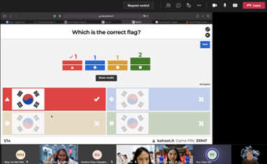
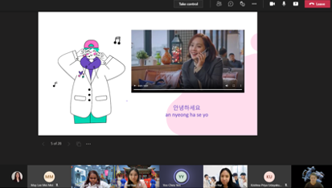

On the 8th of September 2021, SMP leaders, **Yoo Cheu Yen** and **Koh Sher Ree** held a unique engagement session. Our very own SMP leader, **Yoo Cheu Yen** taught us Korean Basic!

<!--truncate-->

However, before she could start teaching us, she needed to test our Korean proficiency. What is the best way to do so? Of course, a Kahoot game filled with K-Pop references and Korean culture. The questions were simple and easy to answer but for the half of us with minimal exposure to the Korean trend, Cheu Yen was basically frying our brains. Either way, it was certainly an euphoric game where we get to tease each other lightheartedly while striving hard for that premium Kahoot podium spot.

After the game, it was time to learn some basic Korean phrases. To warm us up, Cheu Yen had to start with the most basic phrase that I believed even people with minimal exposure of Korean will know; `안녕하세요/annyeonghaseyo`. Thus, reportedly 100 percent of us nail the phrase on the first trial with near perfect pronunciation.

The rest of the phrases were a little harder to get the hang of it but thankfully Cheu Yen was patient enough to teach us. From time to time, we may butchered certain pronunciations. Still, it was “A plus” for all the efforts even though we sounded like dying giraffes. Needless to say, the session was filled with laughter as we laughed at each other’s attempts in trying to pronounce the newly learnt foreign phrases. Overall, it was a great session despite a few hiccups with Internet connections and Stephanie pestering Cheu Yen regarding ramen.

### Here are some phrases that we learnt

1. 꺼져 - **Get lost** : `kkeo jyeo`

2. 애요 - **Why?** : `wae yo`

3. 잠시만요 - **One moment please** : `jam si man yo`

4. 미쳤어 - **Are you crazy?** : `mi Chyeoss eo`

5. 나가 - **Get out** : `na ga`

It was an interesting session! Looking forward to more sessions like this in the future!
