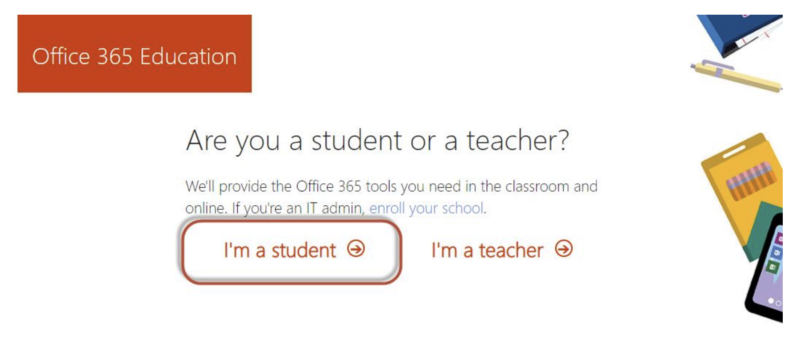
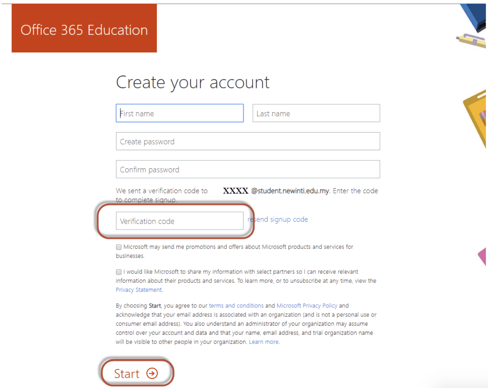
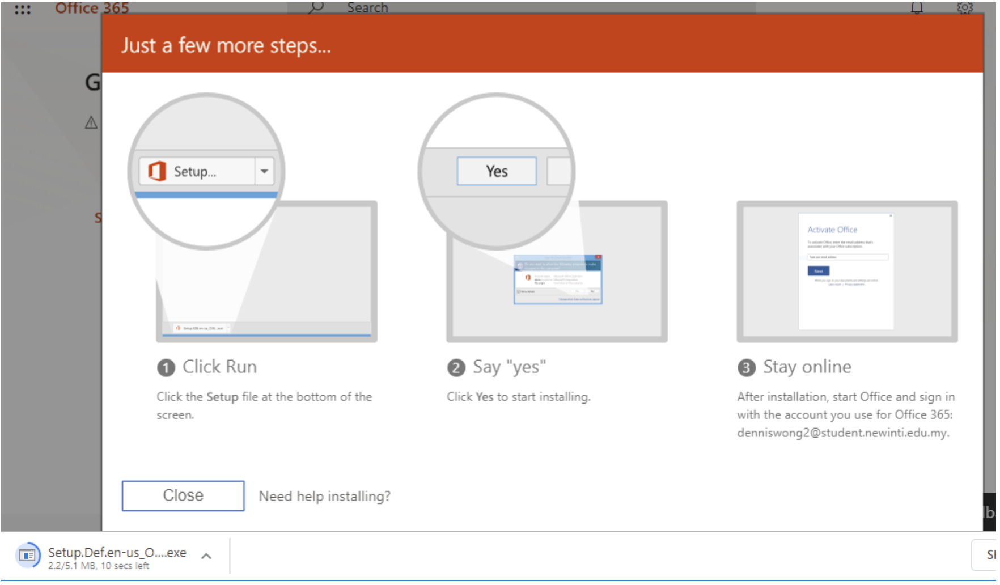

 

Below is the step by step guide to sign up and download Microsoft Office 365 using your **student email address** provided by your college or university.

### Step 1

Go to https://www.microsoft.com/en-us/education/products/office and you will see the page as shown below. Then, enter your **student email address**. For example, i1002@student.newinti.edu.my.

### Step 2

Click “I’m a student”

### Step 3

Create your account by filling up the required information. At the same time, a verification code has been sent to your **student email address**. Check your email inbox and enter the code provided. Lastly, click “Start” to continue.

### Step 4

If you would like to invite your friends to share the benefits of Microsoft Office 365, please do so. Otherwise, continue by clicking “Skip” button.

### Step 5

Now you are prompted to the home page of Microsoft Office 365. Now, click “Install Office” and proceed with “Office 365 apps”. It will start to download Office 365 package.

### Step 6

It will start to download Office 365 package.

### Step 7

It will probably require you to sign in with your **student email address** again in order to proceed with the Office 365 installation.

If you encounter any issues during the installation of Office 365, please refer to the **FAQ section** on the sidebar.
