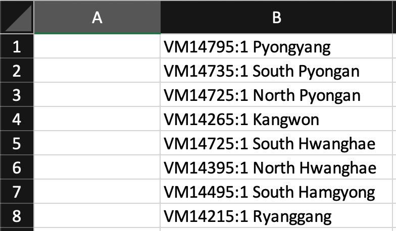
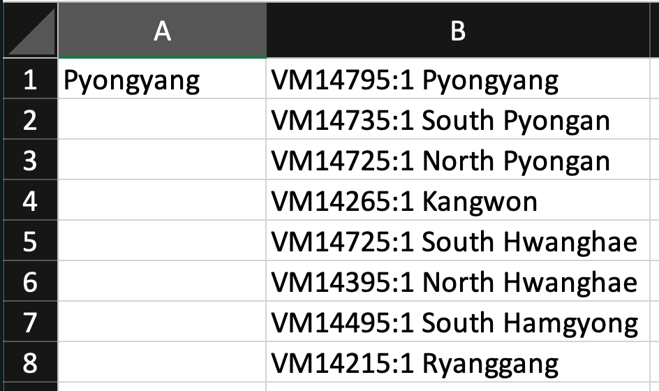
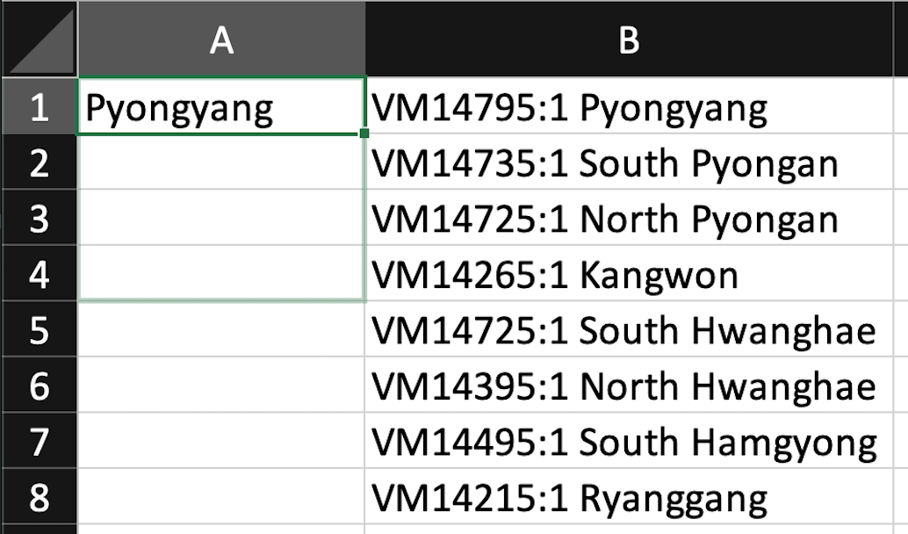
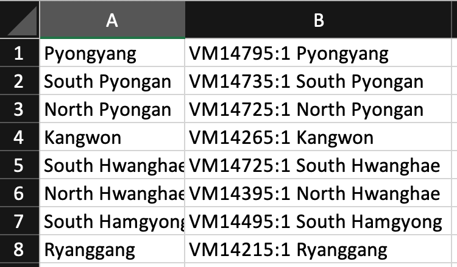

<!-- truncate -->

### Using `RIGHT()`

May use UPPERCASE or lowercase.

```shell
# UPPERCASE
RIGHT(B1, LEN(B1) - 10) 

# lowercase
right(b1, len(b1) - 10)
```

### How to use Excel function?

Always remember to type `=` symbol first before using any Excel function.

### Let's get started 🚀

How it works?

```shell
right(b1, len(b1) - 10)

# right() = extract a given number of characters from the right side of a supplied text string
# len() = get the length of the text
```

As shown below, `len(b1)` equals **19 characters**.

- `VM14795:1 ` (including the whitespace) is **10 characters**.
- `Pyongyang` is **9 characters**.



By using the formula, `len(b1) - 10`. It cuts out the 10 characters including the whitespace before `Pyongyang` while reserving the 9 characters from the left side.



After that, you may drag the box as usual on the right bottom corner.



### Final result 🎊

Da dang!



### References

- https://exceljet.net/excel-functions/excel-right-function