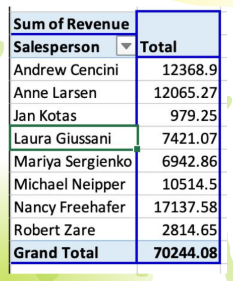
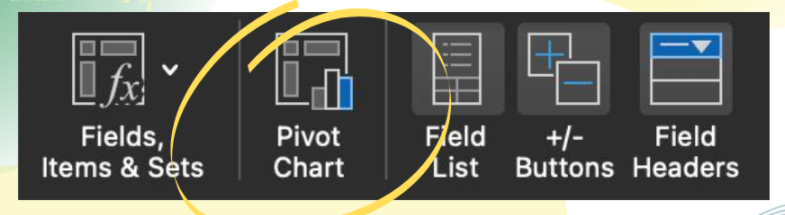
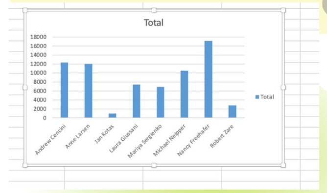
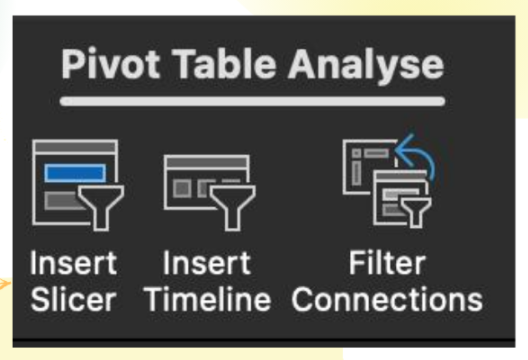
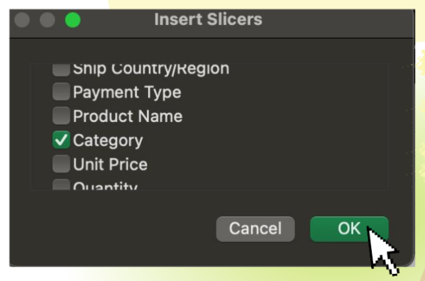
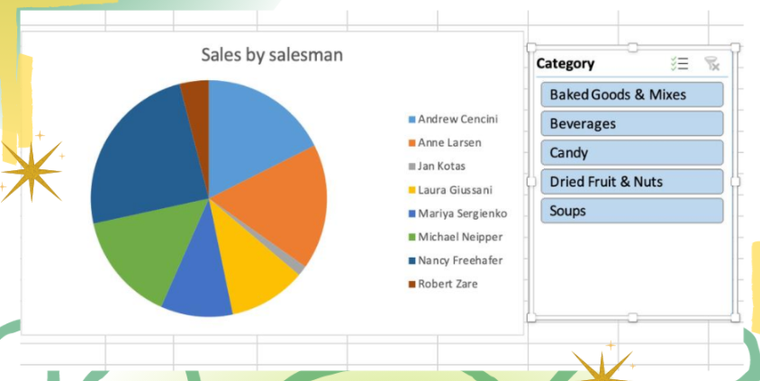

import { AuthorCard } from "@site/src/components/author-card.js";

<AuthorCard
	author={[
		{
			name: "Gladys Loh",
			image: "/img/squad-profile-images/gladys-loh.jpg",
			linkedinUrl: "https://www.linkedin.com/in/gladysloh/",
		},
	]}
/>

Do you know how to create a pivot **chart** from your existing pivot **table**?

:::note

Pivot chart can help make your worksheets more manageable by summarising data, and allow you to quickly change the portion of data displayed, like a pivot table report.

:::

### Step 1

Click any cell inside the pivot table.

### Step 2

Analyze table, and click Pivot Chart.

A Pivot Chart will then be generated as shown below.

### Step 3

Double click on chart then choose **Change Chart Type**, and select **Pie**.

### Step 4

Click **Pivot Table Analyze**, and click **Insert Slicer**.

After that, choose **Category**, and then click **OK**.

### Voila! 🎊

## Stay connected with us

[Instagram](https://www.instagram.com/microsoft_mws/) |
[Facebook](https://www.facebook.com/microsoft.mws) |
[LinkedIn](https://www.linkedin.com/company/mwsquad/)
