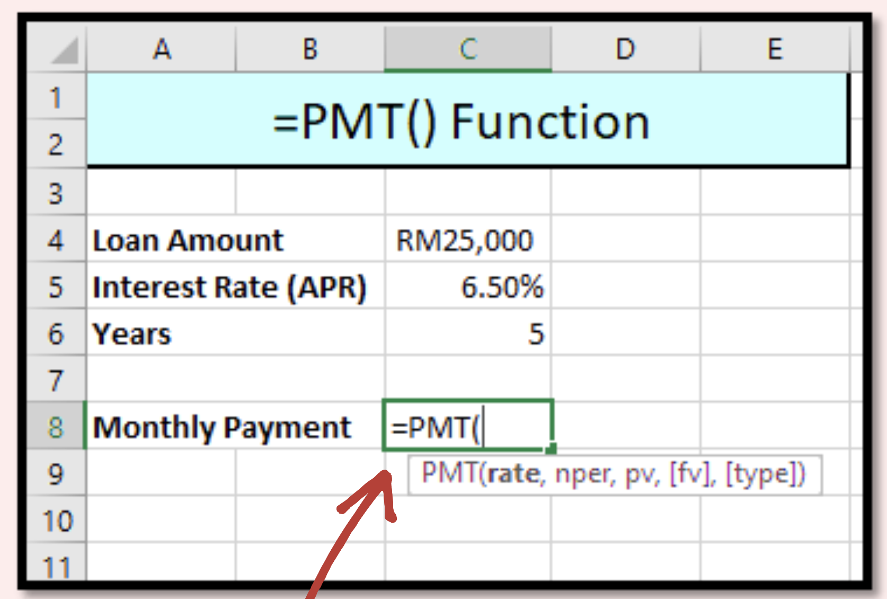
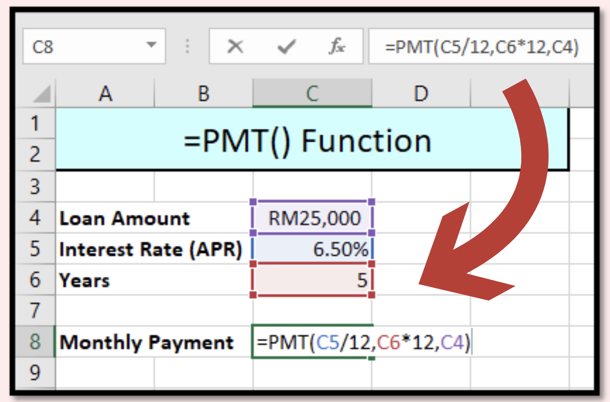
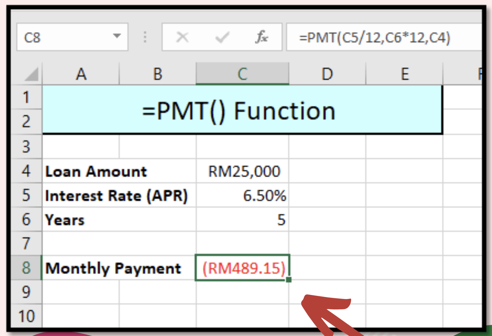
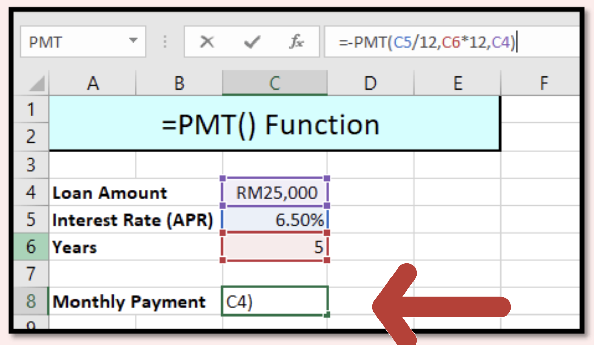
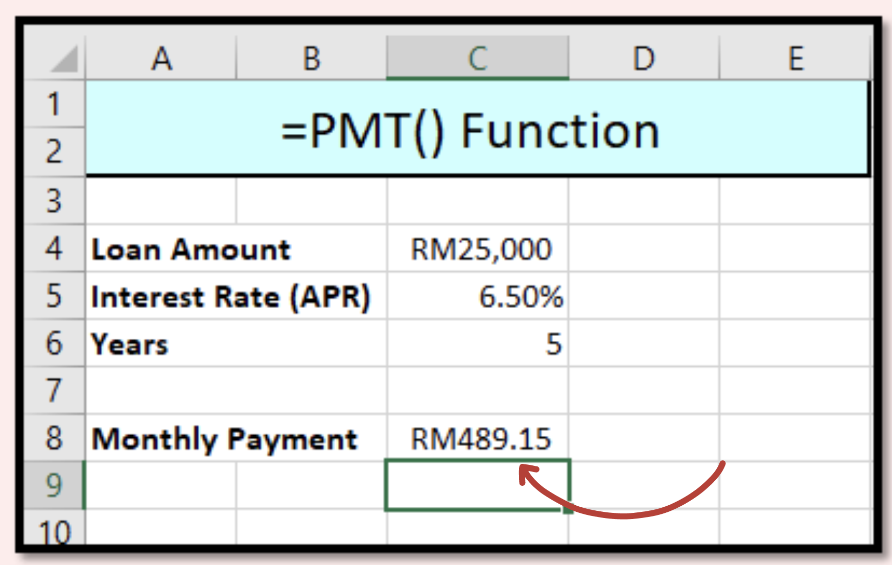

import { AuthorCard } from "@site/src/components/author-card.js";

<AuthorCard
	author={[
		{
			name: "Zhen Hao Lee",
			image: "/img/squad-profile-images/zhen-hao-lee.jpg",
			linkedinUrl: "https://www.linkedin.com/in/lee-zhen-hao-a28a96155/",
		},
		{
			name: "Veishnawi A/P Nehru",
			image: "/img/squad-profile-images/veishnawi-ap-nehru.jpg",
			linkedinUrl: "https://www.linkedin.com/in/taylor-vn-19vn12/",
		},
		{
			name: "Krishna Priya Udayakumar",
			image: "/img/squad-profile-images/krishna-priya-udayakumar.png",
			linkedinUrl: "https://www.linkedin.com/in/krishna-priya-udayakumar-02bb76204",
		},
		{
			name: "Fui May Chong",
			image: "/img/squad-profile-images/fui-may-chong.png",
			linkedinUrl: "https://www.linkedin.com/in/chong-fui-may-421631204",
		},
	]}
/>

Tired of manual calculation for payment?

Why not use the **payment function (PMT)** by Excel?

Follow us in easy steps! ✅

### Step 1

Type the function: `=PMT`

### Step 2

Full function: `=PMT(RATE, NPER, PV, [FV], [TYPE])`

Function breakdown:

1. **RATE** must divide by 12 as we want monthly payment.
2. **NPER** is **number of years**, must be times with 12 since it is monthly payment.
3. **PV** is **present value** which is the loan amount.

### Step 3

You got it! You need to pay RM 489.15 monthly.

### Step 4

Does not like negative sign or bracket?

**Put negative sign in front of PMT**: `=-PMT()`

### Voila! 🎊

## Stay connected with us

[Instagram](https://www.instagram.com/microsoft_mws/) |
[Facebook](https://www.facebook.com/microsoft.mws) |
[LinkedIn](https://www.linkedin.com/company/mwsquad/)
