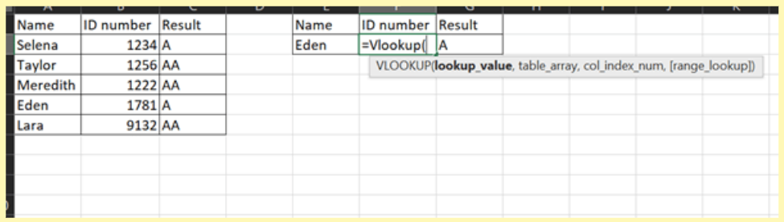
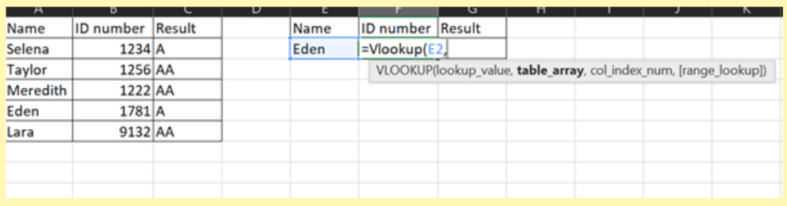
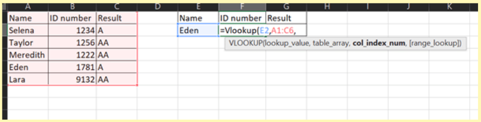
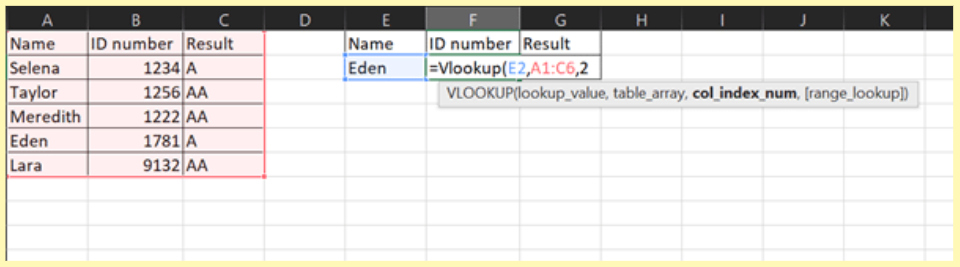
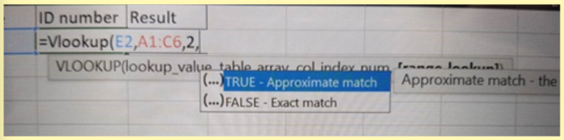
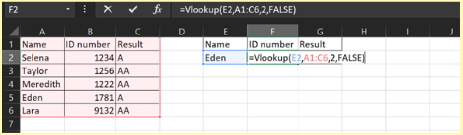

import { AuthorCard } from '@site/src/components/author-card.js';

<AuthorCard name="Zi Ching Goh" image="/img/squad-profile-images/zi-ching-goh.jpg" role="Microsoft MWS Ambassador" linkedinUrl="https://www.linkedin.com/in/zi-ching-g-750b26198/" />

## 😵‍💫 Feeling Dizzy to find what you want among many information?

Here are some tips that will help!

:::note

**V-looup** stands for **"Vertical Lookup"**. It is a function that makes Excel search for a certain value in a column, in order to return a value from a different column in the same row.

:::

Let us begin!

### Step 1

Type in `=vlookup(` as shown below.

### Step 2

As the tooltip suggested, the **loopup_value** should be in cell `E2`.

### Step 3

As for the **table_array** in the tooltip, highlight the whole table that contains the missing information, which is `A1:C6`.

### Step 4

As for the **col_index_num** in this case, the **"ID number"** is in column 2.

### Step 5

Ensure **comma** is in place, and a **context box** will be showing up as shown below.

:::tips

- **True** means that a "close" match will be returned.
- **False** means that VLOOKUP is looking for an **EXACT** match.

:::

### Step 6

Lastly, as for the **range_lookup**, type in **false**, close the bracket, and press Enter key.

### Tada ~~~ We are done! 🎊

## Stay connected with us

[Instagram](https://www.instagram.com/microsoft_mws/) | 
[Facebook](https://www.facebook.com/microsoft.mws) | 
[LinkedIn](https://www.linkedin.com/company/mwsquad/)