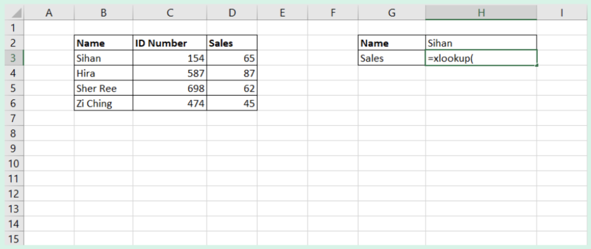
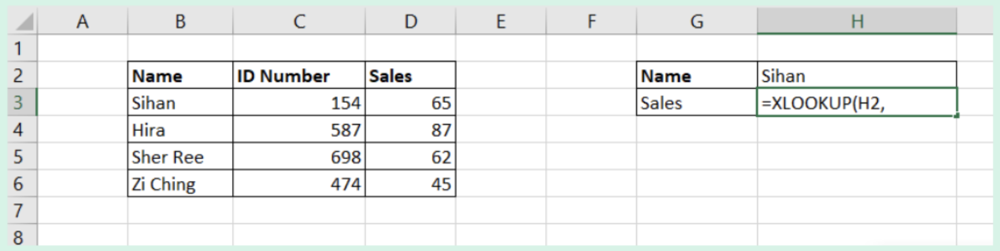
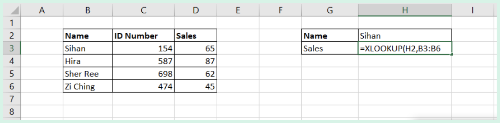
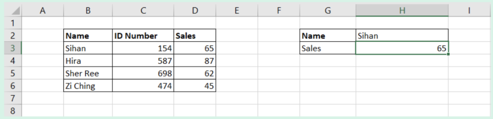

import { AuthorCard } from '@site/src/components/author-card.js';

<AuthorCard name="Tuan Sihan" image="/img/squad-profile-images/tuan-sihan.png" role="Microsoft MWS Ambassador" linkedinUrl="https://www.linkedin.com/in/tuansihan/" />

## One of the best ways to find data

:::note

**X-lookup** function searches a range or an array, and then returns the item corresponding to the first match it finds. If no match exists, then Xlookup can return the closest match. This function can work either **vertically** or **horizontally**.

:::

### Step 1

Type `=xlookup(` as shown below.

### Step 2

Select the **value** to be **found**, and type **comma**.

### Step 3

Select **where** to find **value**, and type **comma**. In this case, it is `B3:B6`.

### Step 4

Select the **range** to find **desired value**, and press **Enter** key.

### TA-DA! And you're done! 🎊

## Stay connected with us

[Instagram](https://www.instagram.com/microsoft_mws/) | 
[Facebook](https://www.facebook.com/microsoft.mws) | 
[LinkedIn](https://www.linkedin.com/company/mwsquad/)