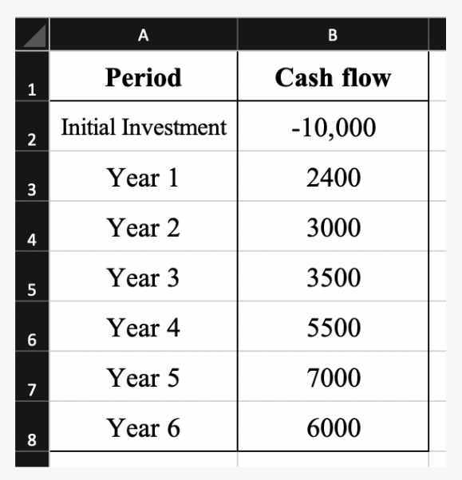
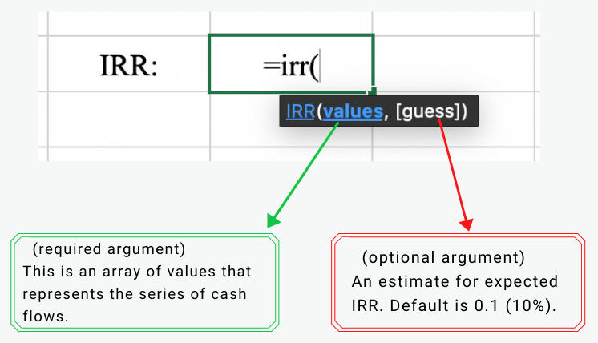
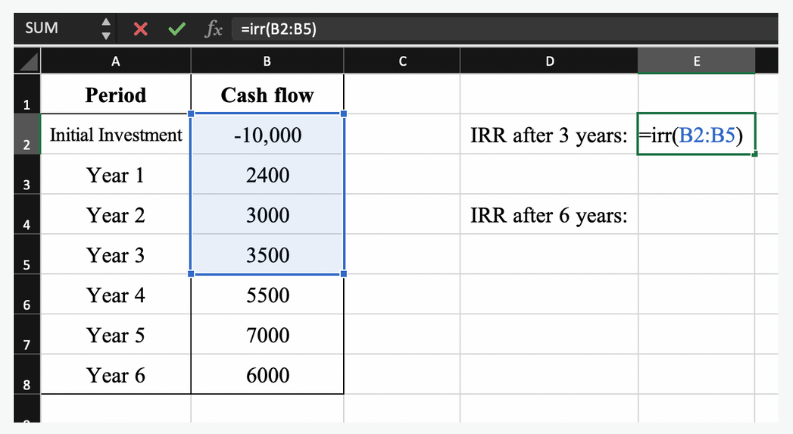
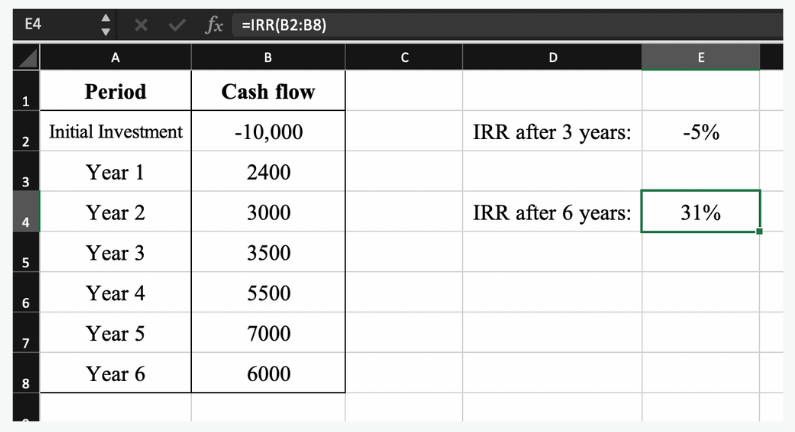

import { AuthorCard } from '@site/src/components/author-card.js';

<AuthorCard
  author={[
    {
      name: 'Ariful Islam',
      image: '/img/squad-profile-images/ariful-islam.jpg',
      linkedinUrl: 'https://www.linkedin.com/in/arif-ai/',
    },
    {
      name: 'Jin En Ng',
      image: '/img/squad-profile-images/jin-en-ng.jpg',
      linkedinUrl: 'https://www.linkedin.com/in/jin-en-ng-a343b51a3/',
    },
    {
      name: 'Stephanie Chong',
      image: '/img/squad-profile-images/stephanie-chong.jpg',
      linkedinUrl: 'https://www.linkedin.com/in/stephanie-chong-7b36291a4/',
    },
    {
      name: 'Fadhilah Nur Rania',
      image: '/img/squad-profile-images/fadhilah-nur-rania.png',
      linkedinUrl: 'https://www.linkedin.com/in/fnrania/',
    },
    {
      name: 'Michelle Loo Xuan Wen',
      image: '/img/squad-profile-images/michelle-xuan-wen-loo.png',
      linkedinUrl:
        'https://www.linkedin.com/in/michelle-loo-xuan-wen-246874201',
    },
  ]}
/>

After doing NPV in Excel, still need to find **IRR** (**Internal Rate of Return**) manually using your calculator?! Excel is your saviour!

How Excel makes the magic happens?

### Step 1

Prepare your data which are **cash flow** & **period**.

### Step 2

Type `=irr(`, and there will be only one required argument which is **values**.

### Step 3

**Select the values** from cash flow that need to be calculated, and **close the bracket**.

Hit the **enter** key, and here comes the magic!

### Final result 🎊

Ace your alternative exams now!

## Stay connected with us

[Instagram](https://www.instagram.com/microsoft_mws/) | [Facebook](https://www.facebook.com/microsoft.mws) | [LinkedIn](https://www.linkedin.com/company/mwsquad/)
