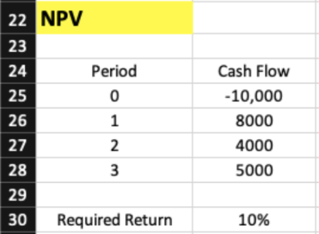
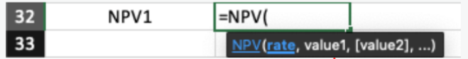
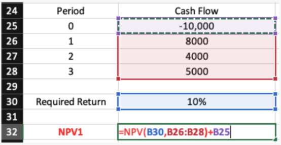
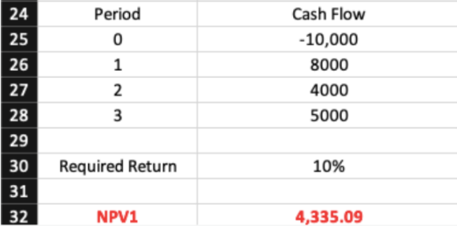

import { AuthorCard } from '@site/src/components/author-card.js';

<AuthorCard name="Stephanie Chong" image="/img/squad-profile-images/stephanie-chong.jpg" role="Squad Member @ Microsoft MWS" linkedinUrl="https://www.linkedin.com/in/stephanie-chong-7b36291a4/" />

## Still calculating NPV manually using calculator?! Here is a better way to do it

How can we make it happen?

### Step 1

Prepare our data 

- **Cash flow**
- **Period**
- **Required return**

### Step 2

Inside a textbox you desire, type `=npv(`, you will get the tiny tab of arguments.

:::tip

1. **Rate argument**

This is your required rate of return or discount rate.

2. **Value 1 argument**

The value of your cash flow.

:::

### Step 3

Select from the **required return**, then select **cash flow** from `B26` to `B28`, and close bracket. Lastly, plus the **initial value** at `B25`.

### Final result 🎊

Da dang!

We don't have to rely on the traditional calculation now :)

## Stay connected with us

[Instagram](https://www.instagram.com/microsoft_mws/) | 
[Facebook](https://www.facebook.com/microsoft.mws) | 
[LinkedIn](https://www.linkedin.com/company/mwsquad/)