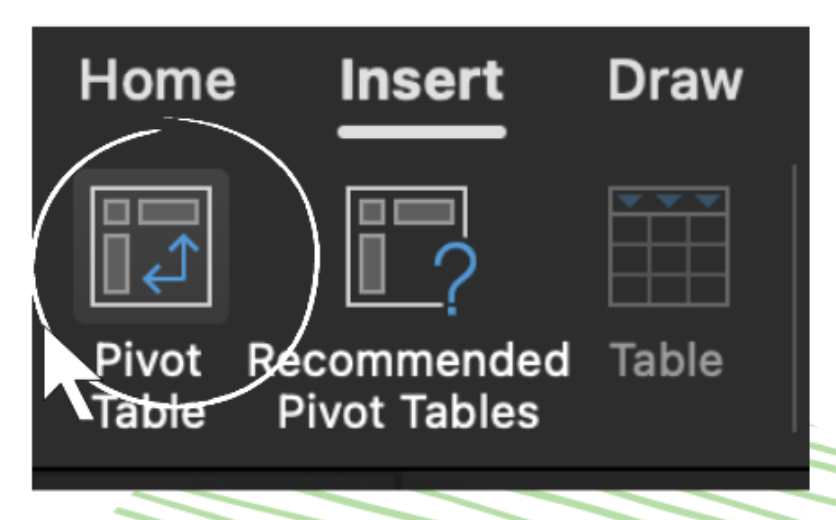
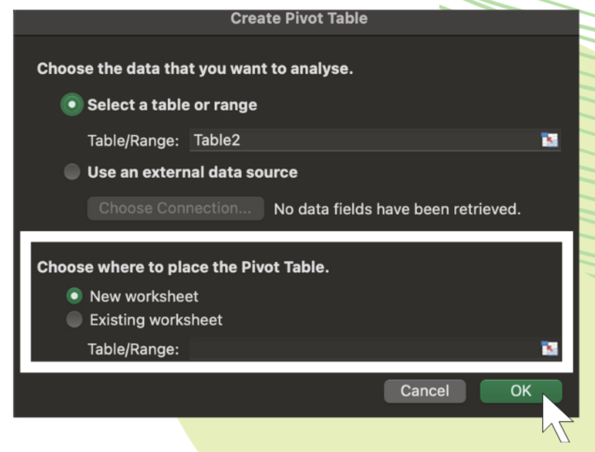
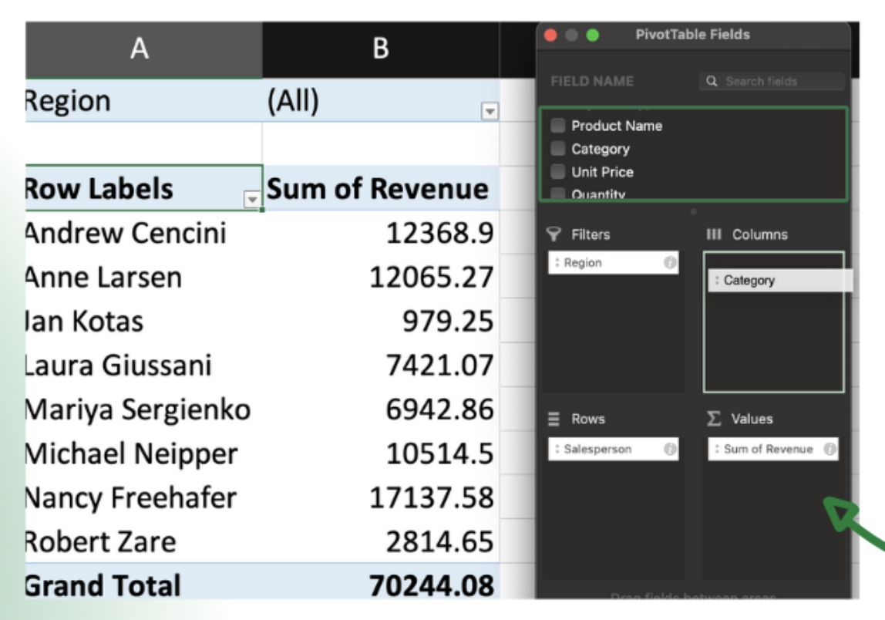
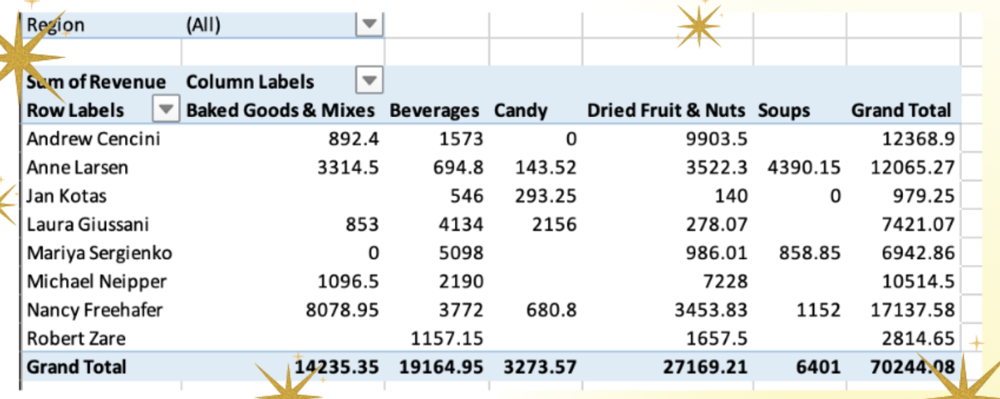

import { AuthorCard } from '@site/src/components/author-card.js';

<AuthorCard name="Gladys Loh" image="/img/squad-profile-images/gladys-loh.jpg" role="Microsoft MWS Ambassador" linkedinUrl="https://www.linkedin.com/in/gladysloh/" />

Want to create different views of reports for large data sets without altering the original data table?

Let pivot tables in Excel do the work for you!

This simple tutorial will provide a guide on how to create a pivot table.

### Step 1 😱

Select the cell we want to create a Pivot Table from.

:::note

Cells should **NOT** have empty columns or rows.

:::

### Step 2

Go to **"Insert"** > **"Pivot Table"**

### Step 3

Choose where the Pivot Table report to be placed at, then click **"OK"**

### Step 4

To move a field from one area to another, drag the field to the target area.

e.g., find the salesman and drag it into **Rows**. Same goes to **_revenue_**, **_region_**, and **_product category_**.

### TADAAA!! 🎊

## Stay connected with us

[Instagram](https://www.instagram.com/microsoft_mws/) | 
[Facebook](https://www.facebook.com/microsoft.mws) | 
[LinkedIn](https://www.linkedin.com/company/mwsquad/)