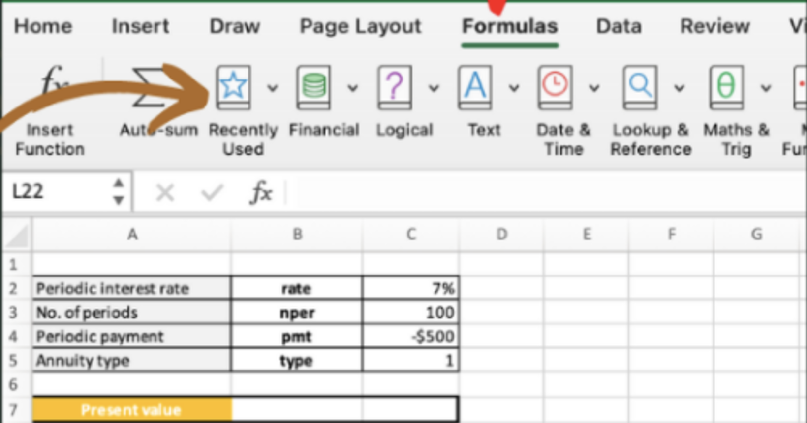
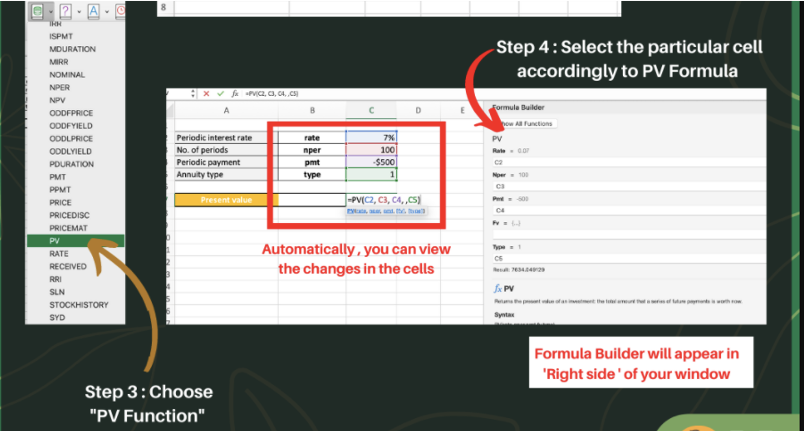
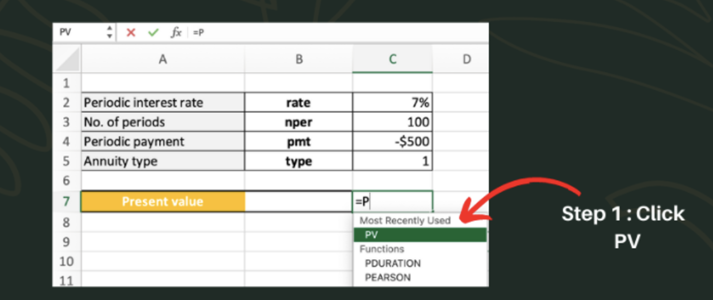
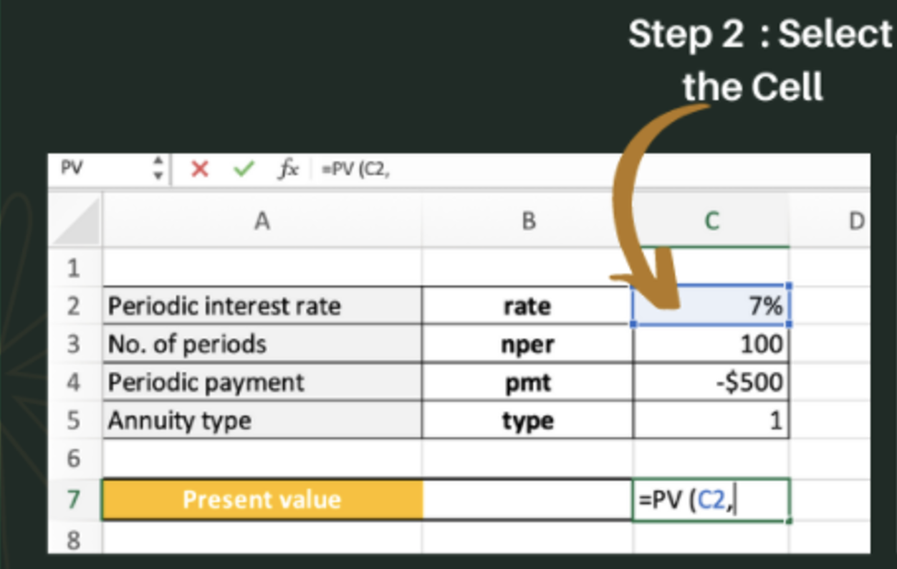
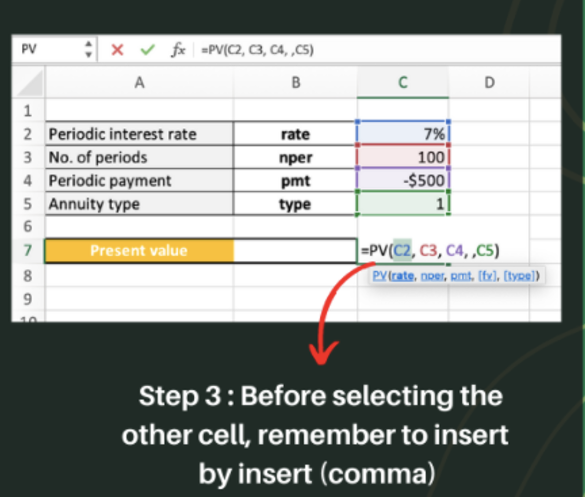
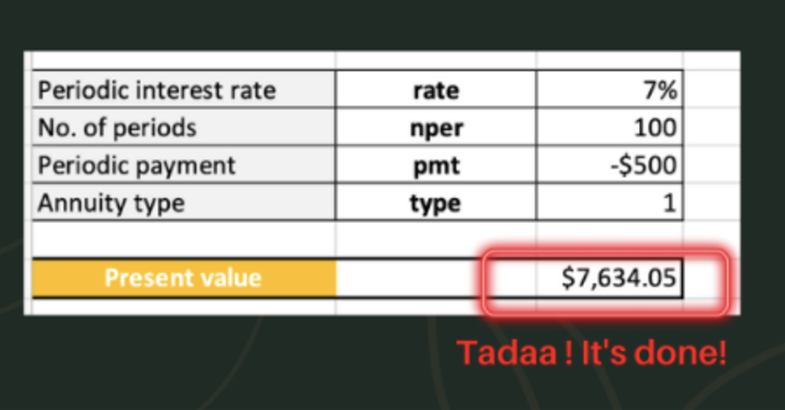
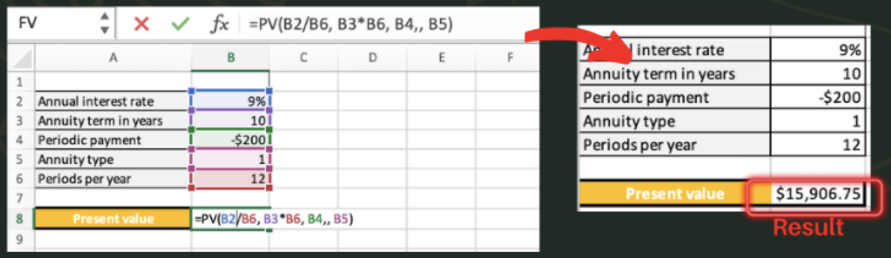
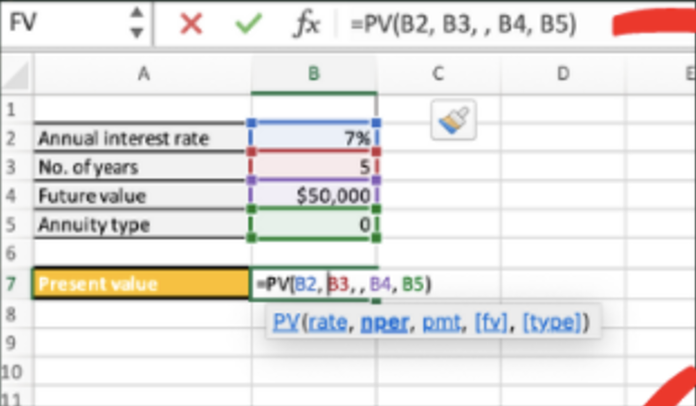
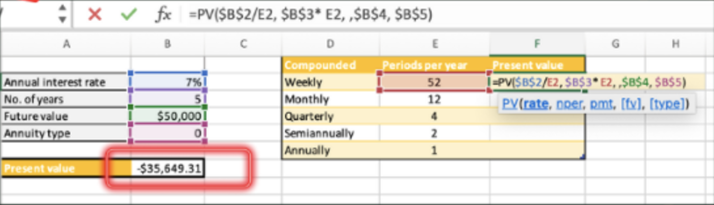
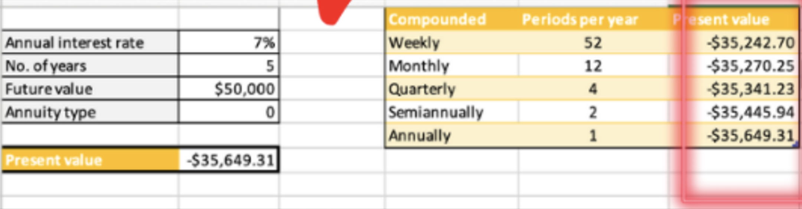

import { AuthorCard } from '@site/src/components/author-card.js';

<AuthorCard name="Krena Shree Paidathalli" image="/img/squad-profile-images/krena-shree.jpg" role="Microsoft MWS Ambassador" linkedinUrl="https://www.linkedin.com/in/krena-shree-0953b61a3/" />

Editor: [Sher Ree Koh](https://www.linkedin.com/in/koh-sher-ree-b8a62a204/) (Microsoft MWS Ambassador)

Have you ever wondered how much should you invest to get back the amount of money you want? Do not worry, Excel got you covered.

:::tip

**Present Value** or also known as PV function is a function in Excel that can help you to calculate the current worth of a future sum of money or stream of cash flow with a given specified rate of return. 

Specifically, the current worth of a future sum of money or stream of cash flows given a specified rate of return. It is calculated by discounting the future sum of money by the specified rate of return, taking into account the time value of money.

Formula: `=PV(rate, nper, pmt, [fv], [type])`

:::

### Step 1

Go to **"Formulas"** tab, and click on **"Financial"**.

### Step 2

Choose the **"PV"** function, and select the cell accordingly to the PV formula.

### Faster way to handle PV function

A better or a faster way to access the PV formula function in Excel is by typing in `=PV(` into a cell, then click on **PV**.

After that, select the cell that contain the **periodic interest rate**. Next, select the **number of periods**. Thirdly select the **periodic payment**. Lastly select the **annuity type**.

Furthermore, remember to **insert a comma** before selecting the other cell.

Tadaa!! It's done!

### Additional knowledge 1 (Annuity)

Besides that, **PV function** can also calculate for **Annuity and Investments**. Take a look in the posts attached below.

### Additional knowledge 2 (Investments)

Easy way to find out how much money we need to invest today to reach the target amount at the end of the investment period.

Takig a closer look at the results, the best deal for us is weekly compounding - by investing the smallest amount of money now, we will get the same $50,000 in 5 years.

**P.S. Bookmark this page and visit us frequently for further updates. Cheerios.**
