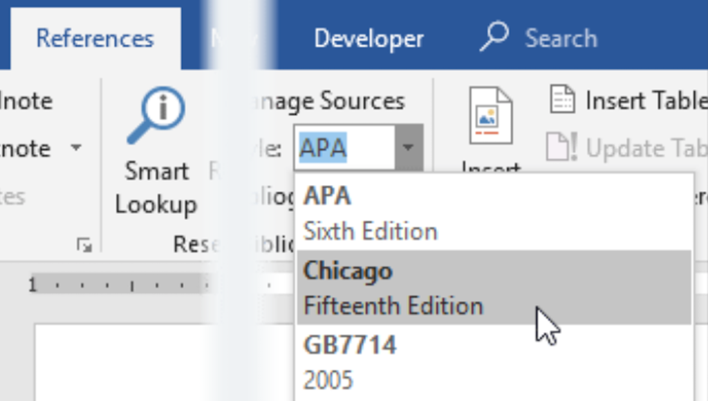
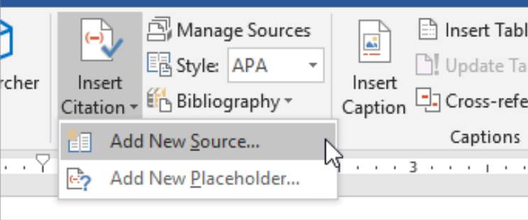
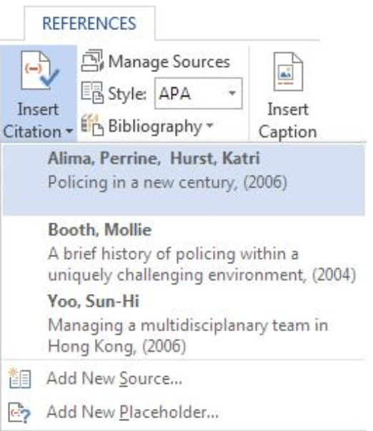
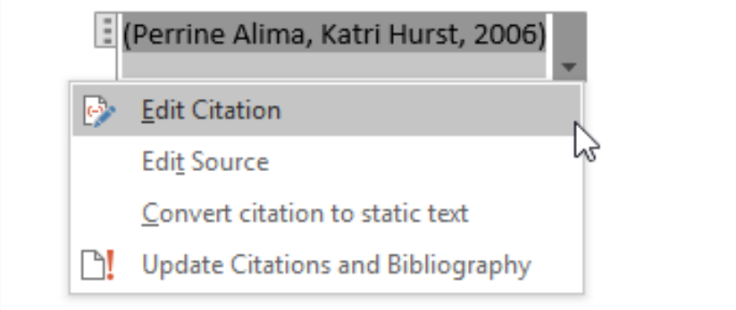

import { AuthorCard } from '@site/src/components/author-card.js';

<AuthorCard name="Jenn Fu" image="/img/squad-profile-images/jenn-fu.png" role="Microsoft MWS Ambassador" linkedinUrl="https://www.linkedin.com/in/jenn-fu-75674719b/" />

Do you know that you don't have to do citations by yourself. 

So you can save more time for your assignments. 😍

The short and sweet `video version` is on our [Instagram](https://www.instagram.com/microsoft_mws/)!

## Let's get started

### Step 1

Put your cursor at the end of the text you want to cite.

### Step 2

Go to **References** > **Style**, and choose a citation style.

### Step 3

Select **Insert Citation**. 

Choose **Add New Source** and fill out the information about your source.

:::tip

Once you've added a `source` to your list, you can cite it again. 

In other words, the `source` can be reused.

:::

## To reuse the source

### Step 1

Put your cursor at the end of your list.

Go to **References** > **Insert Citation**, and choose the source you are citing.

### Step 2

To add details, like page number if you are citing a book, select **Citation Option**, and then **Edit Citation**.

### The End 🎊

## Stay connected with us

[Instagram](https://www.instagram.com/microsoft_mws/) | 
[Facebook](https://www.facebook.com/microsoft.mws) | 
[LinkedIn](https://www.linkedin.com/company/mwsquad/)

