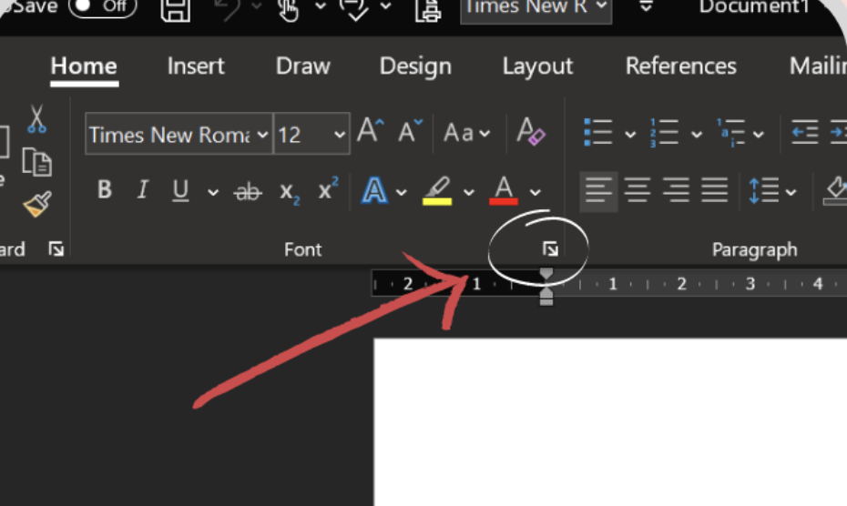
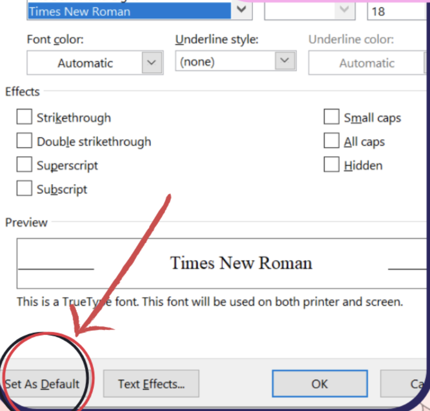
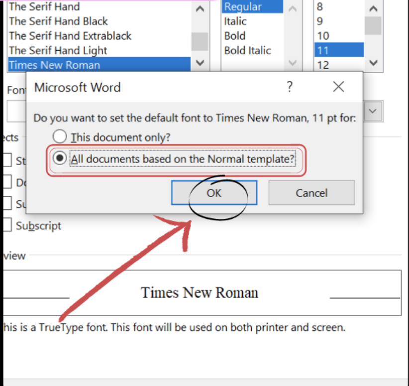

import { AuthorCard } from '@site/src/components/author-card.js';

<AuthorCard name="Sher Ree Koh" image="/img/squad-profile-images/sher-ree-koh.png" role="Squad Member @ Microsoft MWS" linkedinUrl="https://www.linkedin.com/in/koh-sher-ree-b8a62a204/" />

### Step 1

Select the Font Dialog Box Launcher located between the "Font" and "Paragraph".

### Step 2

Select the font and size you desire then **Set As Default**.

### Step 3

Select "*All documents based on the Normal template?*" then click **OK**!

### The End 🎊

## Stay connected with us

[Instagram](https://www.instagram.com/microsoft_mws/) | 
[Facebook](https://www.facebook.com/microsoft.mws) | 
[LinkedIn](https://www.linkedin.com/company/mwsquad/)
