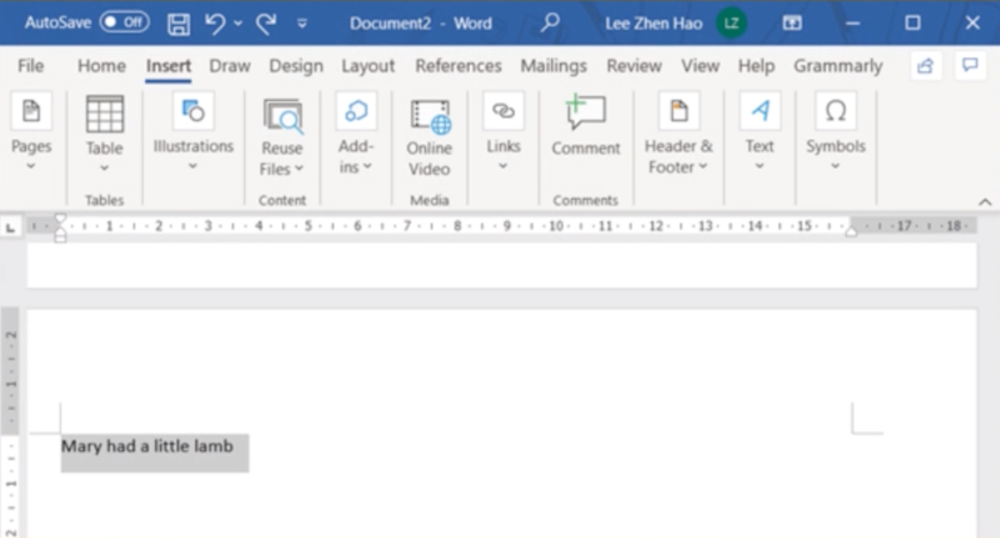
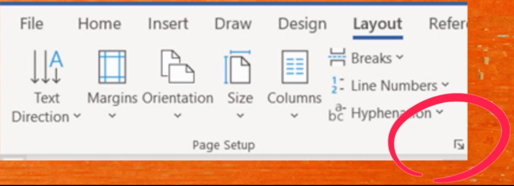
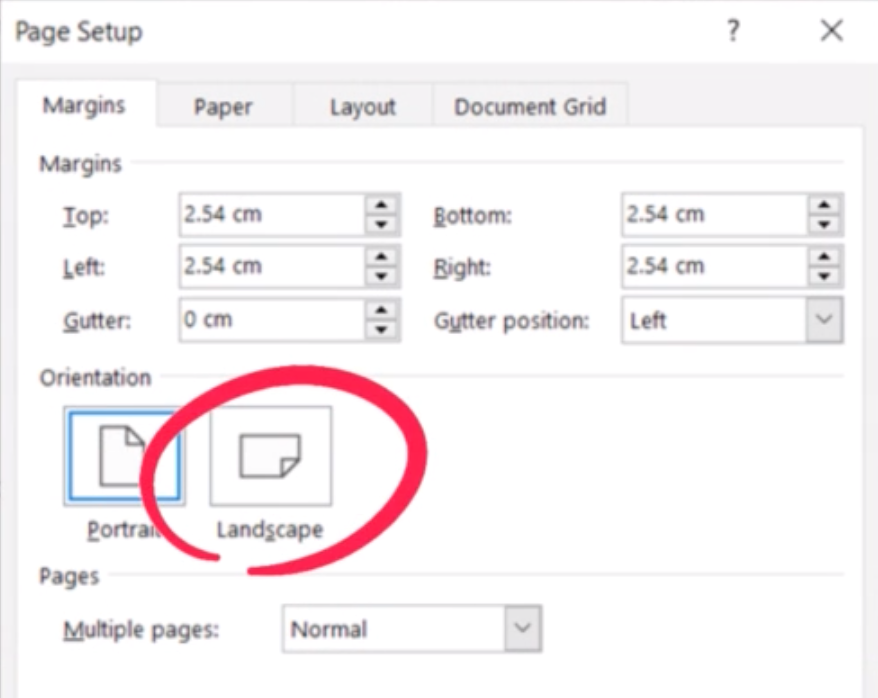
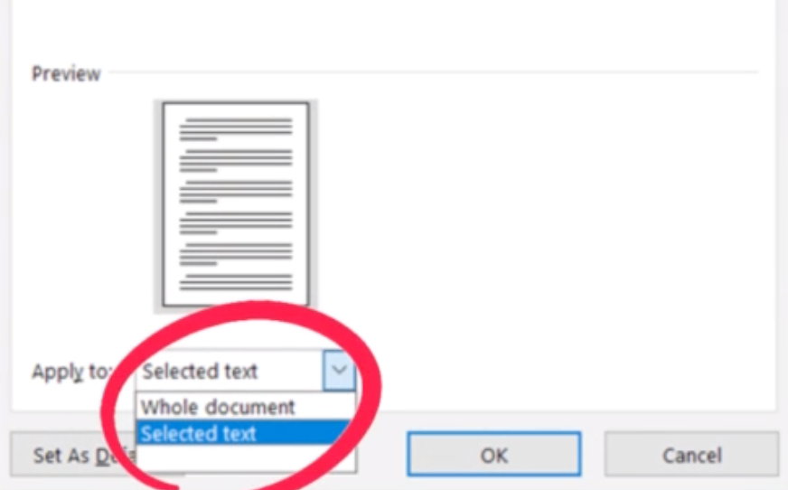
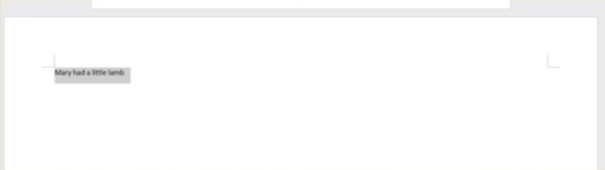

import { AuthorCard } from "@site/src/components/author-card.js";

<AuthorCard
	author={[
		{
			name: "Krishna Priya Udayakumar",
			image: "/img/squad-profile-images/krishna-priya-udayakumar.png",
			linkedinUrl: "https://www.linkedin.com/in/krishna-priya-udayakumar-02bb76204",
		},
		{
			name: "Zhen Hao Lee",
			image: "/img/squad-profile-images/zhen-hao-lee.jpg",
			linkedinUrl: "https://www.linkedin.com/in/lee-zhen-hao-a28a96155/",
		},
		{
			name: "Zi Ching Goh",
			image: "/img/squad-profile-images/zi-ching-goh.jpg",
			linkedinUrl: "https://www.linkedin.com/in/zi-ching-g-750b26198/",
		},
		{
			name: "Fui May Chong",
			image: "/img/squad-profile-images/fui-may-chong.png",
			linkedinUrl: "https://www.linkedin.com/in/chong-fui-may-421631204",
		},
	]}
/>

Wished to only change one page as landscape mode or vise versa 🤯? Here is the step-by-step guide to do so! 🤩

### Step 1

Highlight the sentence on a page that you want to change into landscape mode.

### Step 2

Go to Layout & Select Page Setup Dialog Box

### Step 3

1. Select "**Landscape**", and do not exit yet.

2. Go to "**Apply to**"

3. Choose "**Selected Text**"
4. Click on "**OK**"

### Final result 🥳

And we are done!

### The End 🎊

## Stay connected with us

[Instagram](https://www.instagram.com/microsoft_mws/) |
[Facebook](https://www.facebook.com/microsoft.mws) |
[LinkedIn](https://www.linkedin.com/company/mwsquad/)
