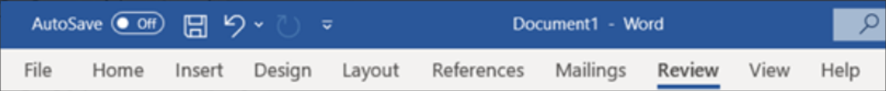
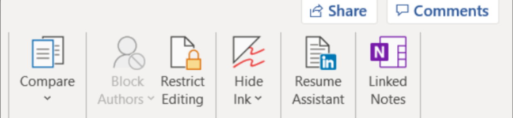
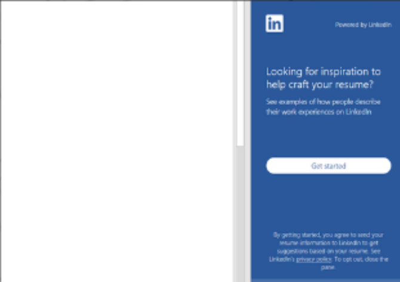
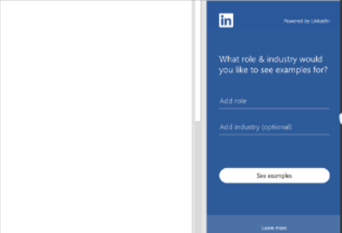
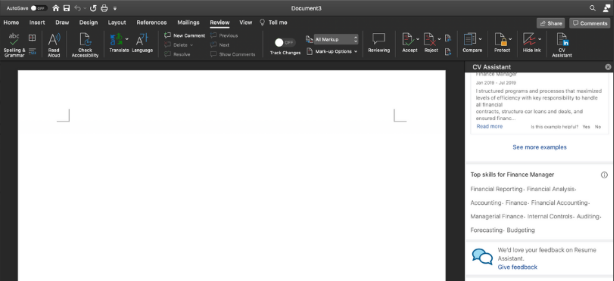
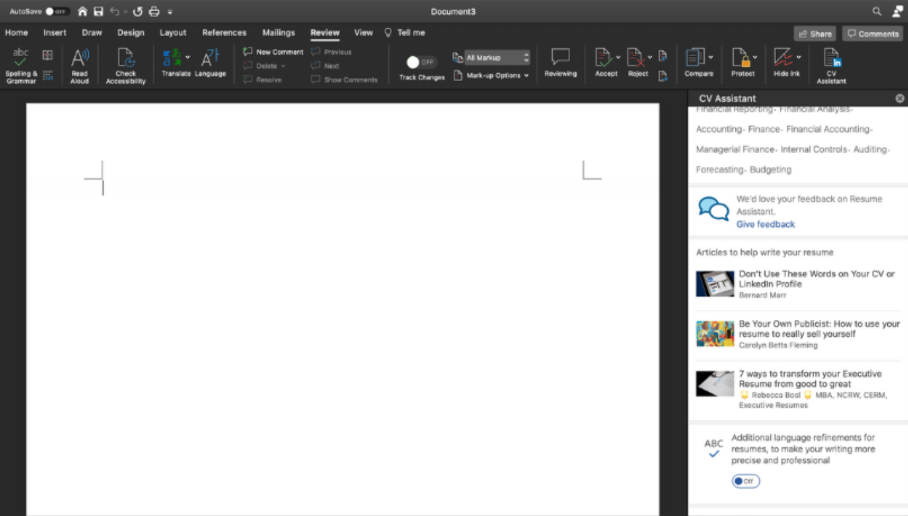
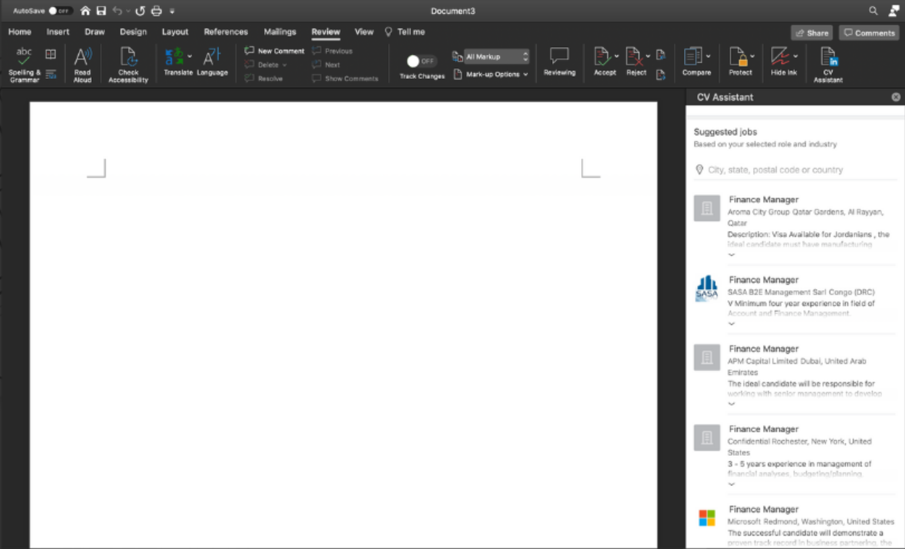

import { AuthorCard } from '@site/src/components/author-card.js';

<AuthorCard
  author={[
    {
      name: 'Evelyn Cheah',
      image: '/img/squad-profile-images/sze-yin-cheah-evelyn.jpg',
      linkedinUrl: 'https://www.linkedin.com/in/szeyincheahevelyn/',
    },
    {
      name: 'Krena Shree Paidathalli',
      image: '/img/squad-profile-images/krena-shree.jpg',
      linkedinUrl: 'https://www.linkedin.com/in/krena-shree-0953b61a3/',
    },
    {
      name: 'Cheu Yen Yoo',
      image: '/img/squad-profile-images/yen-yoo-cheu.png',
      linkedinUrl: 'https://www.linkedin.com/in/yoo-cheu-yen-4713731a4/',
    },
    {
      name: 'Cze Yik Lee',
      image: '/img/squad-profile-images/cze-yik-lee.jpg',
      linkedinUrl: 'https://www.linkedin.com/in/cze-yik-lee-980a041a9/',
    },
    {
      name: 'Ainaa Radhiah Binti Nur Azam',
      image: '/img/squad-profile-images/ainaa-azam.png',
      linkedinUrl: 'https://www.linkedin.com/in/ainaarna',
    },
  ]}
/>

Are you graduating and applying for a job soon, but have no idea how to make your resume stands out from others? No worries, as Resume Assistant got you covered.

By using Resume Assistant on Microsoft Word, you could have access to endless of inspirations at your convenience — as you write your resume.

### Step 1

To access onto the **Resume Assistant**, click on the **Review Tab**.

### Step 2

Click onto **Resume Assistant**.

### Step 3

Once click onto **Review Tab**, this will pop up. Click onto **Get started** to proceed further.

### Step 4

It will bring you here. Then, key in your desired role and industry. Once completed, proceed to browse the list of examples.

### Step 5

You will be able to see the suggestions on the **Top Skills** for Business Analyst role. Add it in the resume's samples.

### Step 6

Bonus: There are also some articles and tips available!

### Step 7

If you scroll further down, there are suggested jobs available. Besides, you are able to browser the company's profile and tailor your resume at the same time.

### The End 🎊

## Stay connected with us

[Instagram](https://www.instagram.com/microsoft_mws/) | [Facebook](https://www.facebook.com/microsoft.mws) | [LinkedIn](https://www.linkedin.com/company/mwsquad/)
