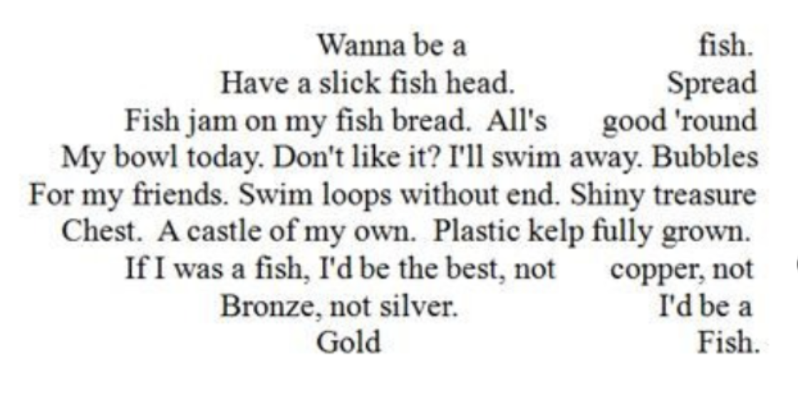
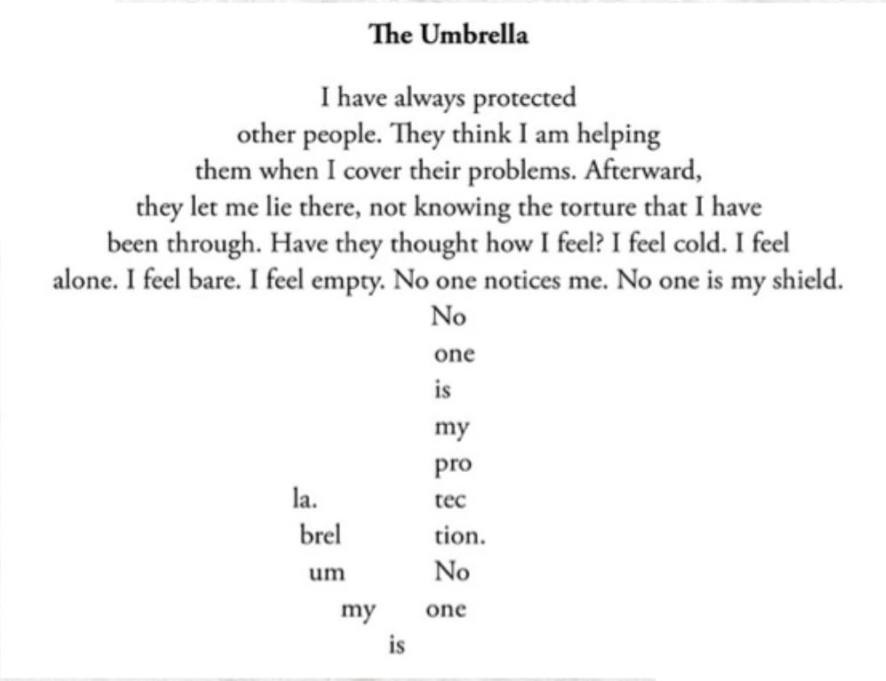
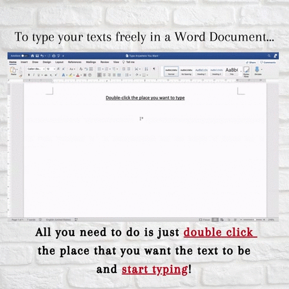

import { AuthorCard } from '@site/src/components/author-card.js';

<AuthorCard name="Ain Batrisyia" image="/img/squad-profile-images/ain-batrisyia.jpeg" role="Microsoft MWS Ambassador" linkedinUrl="https://www.linkedin.com/in/ainbatrisyiashaharuddin/" />

Frustrated with using spacebars for special alignments? No more wasting time on spacebar/tab/textbox!

### Have you ever saw poems like this?

Poem about fish that is written in the shape of a fish.

Poem about Umbrella in the shape of an umbrella?

### All you need to do 🥳

Just **double click** the space that you want the text to be and **start typing**!

### The End 🎊

## Stay connected with us

[Instagram](https://www.instagram.com/microsoft_mws/) | 
[Facebook](https://www.facebook.com/microsoft.mws) | 
[LinkedIn](https://www.linkedin.com/company/mwsquad/)
