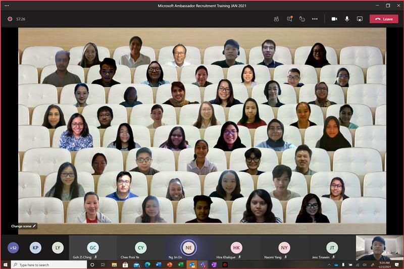
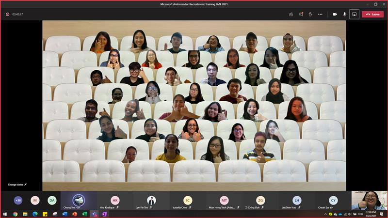

This is a 3-day event organized by Modern Workplace Squad.

 

### 23 January 2021

This is the group photo taken on training session day 1.

### 24 January 2021

This is the group photo taken on training session day 2.

### 27 January 2021

This is the group photo taken on assessment session day 3.

### The new babies of Modern Workplace Squad

1. Yoo Cheu Yen
2. Sihan Rainudeen Tuan Harith
3. Ainaa Radhiah Binti Nur Azam
4. Krishna Priya Udayakumar
5. Kreepa Shree A/p Paidathalli
6. Lee Cze Yik
7. Ariful Islam
8. Fadhilah Nur Rania
9. Veishnawi A/p Nehru
10. Loo Xuan Wen
11. Fu Shin Hui
12. Koh Sher Ree
13. Dafina Siti Marsya Amanda
14. Chong Fui May
15. Louis Ezra Endro

### Kudos to organizing committee!

---

| Name                  | Role                               |
| --------------------- | ---------------------------------- |
| Isabella Chee         | Organizer                          |
| Zi Ching Khor         | Organizer, Word + OneDrive trainer |
| Hira Khalique         | Organizer, PowerPoint trainer      |
| Krena Shree           | Organizer, Outlook trainer         |
| Evelyn Cheah (Evelyn) | Teams trainer                      |
| Yee Han Chung         | Teams trainer                      |
| Poh Yee Lew           | Word + OneDrive trainer            |
| Jye Yie Tee           | Excel trainer                      |
| Jin En Ng             | OneNote trainer                    |
| Stephanie Chong       | Usher                              |

### That's a wrap for the assessment session!