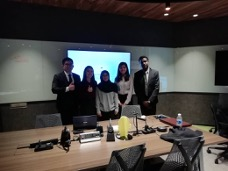
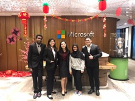
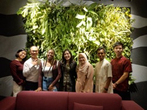

That's a 🎉 wrap for being the leaders of Microsoft Modern Workplace Squad from **April** to **June** 2020.

<!--truncate-->

## Gladys

> My journey with Microsoft Modern Workplace Squad (MWS) was a very eye-opening and fruitful one. I recall starting off my journey as a first-year student back in January 2020. In the early days of joining the squad, I had no clue as to how far this journey will take me and how much I can add value to the team as a freshman. Looking back now after almost two years being with the team, there is one thing I can say for sure, that is I have no regrets joining MWS. The knowledge I have acquired during this one year and ten months journey have truly created a significant impact to my personal development. I was able to develop a good mix of hard and soft skills which helped to shape me into the person I am today, with improved interpersonal and leadership qualities. Being part of the squad with bright-minded people made me feel that I should not be overly complacent in my own role but it could be detrimental to my overall well-being if I am too hard on myself either. Therefore, I quickly came to realise that I needed to always treat myself as a work-in-progress.
>
> Four months into the journey, I decided to volunteer myself as the Chief Financial Officer (CFO) representative of Nilai campus as I was keen to acquire practical experiences in the financial areas, after all my plan was to venture into a career in accounting or finance upon graduation. I treasure the brainstorming sessions with the leaders who were in the same batch as me namely, Kai Lun, Kashmieethaa and Yi Wen. We put in equal efforts in coming up with the idea of starting a Social Media Programme (SMP) which we think is relevant in this digital age yet beneficial to the squad members, as everyone will get to learn how to manage social media pages whilst sharing the latest Microsoft tips and tricks. Although everyone had their personal commitments at that time, we tried our best in engaging the members whilst delivering quality internal trainings with the squad to upskill themselves.
>
> However, my regrets were not being able to fully work on my CFO role, as there were no travels involved and I was not able to collect receipts and file for claims etc. Eventually, my CFO role had transformed into a Vice Leader role due to the pandemic. It was no longer the position I had applied for in the first place. Nevertheless, I was exposed to other areas which were beneficial to my personal growth but in different ways than expected. We took over the leaders’ roles at the beginning of COVID-19 pandemic when there were too many uncertainties and everyone was still adjusting to remote learning. Therefore, the participation rate of our virtual events was relatively low. To be frank, constant reminders of being active in our meetings were taxing for us leaders as not every member was ready to put in their 100% in order to make our plans a successful one. Besides that, I personally find it challenging to juggle frequent meetings, part-time job, studies and assignments as well.
>
> As time went by, things started to get better. Over the period of 8th July 2021 to 17th July 2021, we decided to collaborate with Leo Club of INTI International University for an exciting event – Hear My Sign! It was my great pleasure to be part of the organising committee of Hear My Sign, in which we managed to collaborate with Leo Club of INTI International University to raise funds for Malaysian Federation of the Deaf (MFD). Hear My Sign comprised a sign language class, fund-drive, and video challenge on Instagram. The aim of this project was to spread public awareness about deafness whilst promoting the sign language lessons offered by MFD during the trying times of COVID-19 pandemic. I was delighted to take up the role as the Vice Organising Chairperson of the event. My duties mainly revolved around creating posters as well as managing the social media pages of the said event. Besides that, we had to liaise with the person-in-charge of collaboration matters in MFD, who is Ms. Zuraida, and make sure that we find a suitable time and date to conduct the sign language class via Microsoft Teams. At the beginning, it was quite challenging to attract people inside and outside our organisation to join the class and the video challenge on Instagram. It was only slowly through combined efforts that we managed to hit our targeted number of participants. It was also a real challenge for all of us to raise funds even with joint efforts. Fortunately, through connections we managed to raise RM845.00 collaboratively over the span of just ten days! We were proud to inform all participants that with their generous giving, 100% of the proceeds were donated to Malaysian Federation of the Deaf (MFD).
>
> The process of organising such event was undoubtedly a tiring one, considering it was a relatively big scale project I have handed so far. Albeit there were several moments in which we thought we may not be able to execute our plans, we managed to pull through with selfless efforts. We knew our hard work paid off when the responses and results were beyond our expectations!
>
> Scrolling through my gallery, I certainly enjoyed my time at MWS. There are plenty of moments I will cherish forever, and it is quite hard to pick my favourite one. The one that crossed my mind now is the “Lou Sang” session organised by Microsoft Malaysia back in January 2020 at Microsoft Malaysia’s headquarter located at Nu Sentral Tower. It was great to see everyone in their traditional costumes and getting to know each other more. It is a shame that we couldn’t do it again this year due to the on-going pandemic.
>
> One of the lessons I have learnt from my journey as an ambassador would be to always strike a right balance between MWS activities and studies. It is crucial to always plan ahead and practise discipline in adhering to the schedule fixed. In addition, after volunteering as a trainer for four times, I do think that it is vital to rehearse several times at home before attending dry runs as it would be a waste of time if I come unprepared and it would not be fair for other trainers and leaders who have to spare their time reviewing my performance over and over again, if unsatisfactory.
>
> Even though things could get pretty overwhelming at times, I always remind myself of my purpose joining the squad. At the very beginning of being selected as a student ambassador for Microsoft, my only expectation was to learn more about Microsoft applications. Out of expectation, I get to hone leadership skills as well. Therefore, I really appreciate the people I have crossed paths with, and I cannot express enough how grateful I am to everyone who has been part of this journey. As my time with MWS does not end until I graduate next year, I hope that I will continue to equip myself with other Microsoft applications like Microsoft Excel at intermediate level. I certainly believe mastering the Excel functions will be useful for my career in future.
>
> My future hopes and expectations for MWS will be to expand the squad to more campuses abroad, not limiting to INTI students exclusively as I believe being able to work in a diversity environment is an important element in the working world. I feel that there are more people out there who need to hear about the amazing projects we have carried out and explore what we have in store for them! By including diversity into MWS, it will surely help students to expand their horizons in terms of the ability to connect with people with different minds. In addition, I also look forward to seeing more collaborations with organisations and clubs within or outside of the INTI community. I am also anticipating more students joining the MWS family as they will be ahead of their peers by taking the initiatives to pick up the latest Microsoft tips and tricks. This is because MWS members always strive their best in honing their soft skills like presenting and pitching skills as well as being great team players.
>
> To conclude, I am happy that I made the right choice of attending the workshop and assessment in the first place back in my first-year of studies. Without taking the first step, I would not have become a student ambassador under the big company - Microsoft Malaysia, which has given me the platform to gain invaluable experience and meeting so many awesome people at MWS. With that being said, I am forever grateful for the opportunities and experiences I have gained throughout this journey!
>
> Moreover, I would like to extend my deepest gratitude towards Mr. Seng, Ms. Cassandra and Mun Hong, who have all guided me since my very first day of joining the family. My journey at MWS will be cherished forever and it will be one of the best decisions I have made during my undergraduate studies at INTI. I wish the future MWS leaders the best in launching the upcoming events and I hope they will strive to unleash their fullest potential with the amazing squad! Last but not least, I also hope that we could arrange a reunion with the alumni some day!
>
> Photos taken at Microsoft Malaysia Office 😊
>
>  >  >  >  > 
