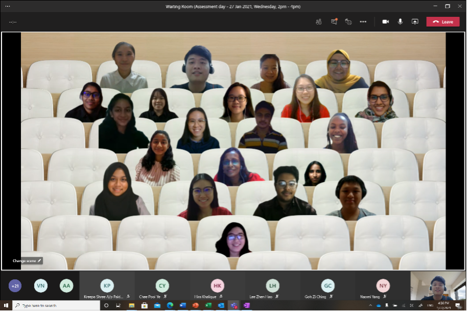
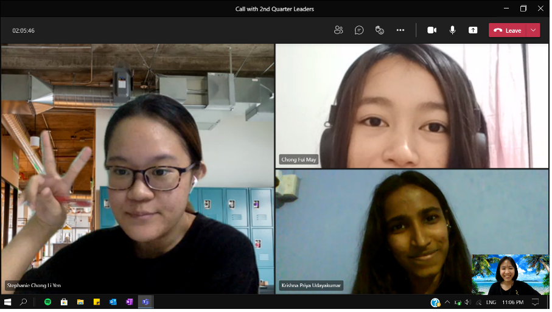
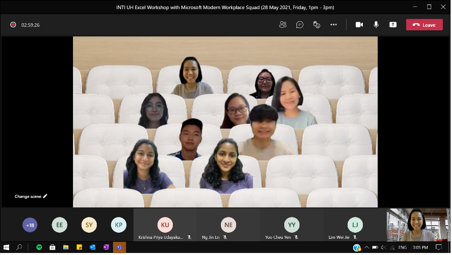
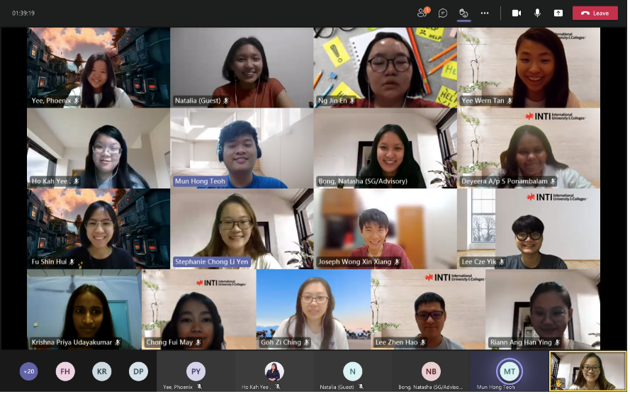
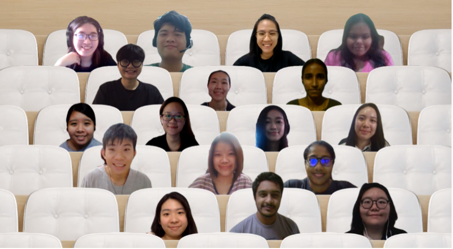
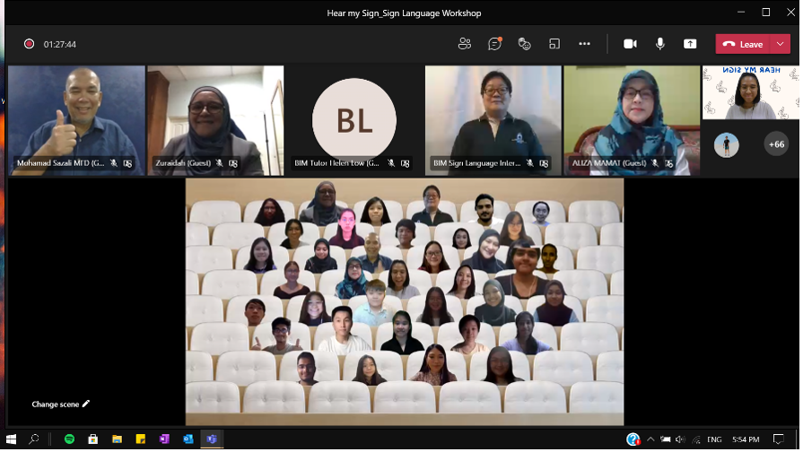
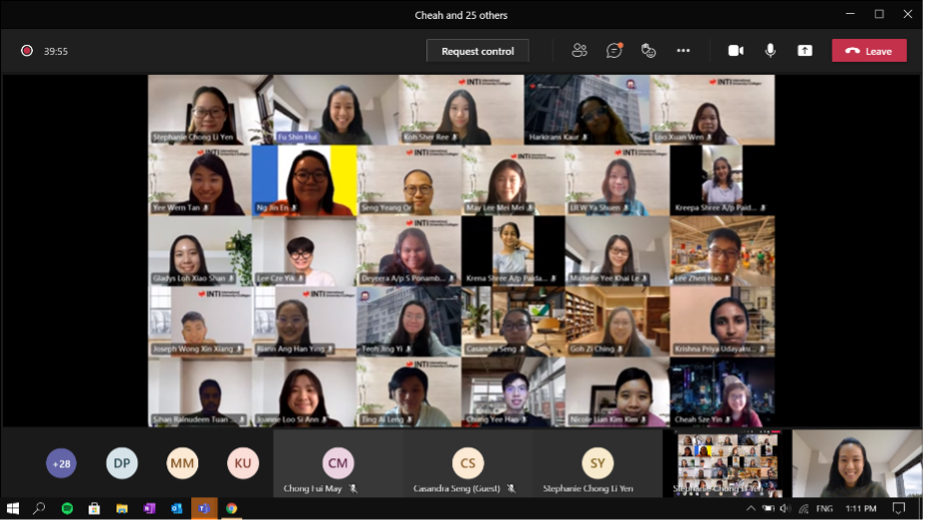
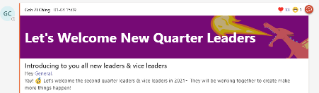
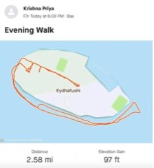
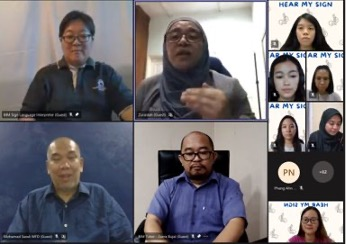

That's a 🎉 wrap for being the leaders of Microsoft Modern Workplace Squad from **April** to **September** 2021.

<!--truncate-->

## Fui May

> My journey started when I joined MWS Squad in February 2021 as a general member. I was excited and volunteered myself as the Excel trainer for UH Excel Workshop. It was awesome since it was my first experience to be Excel trainer. The leaders also helping me during the dry run to ensure my training will run smoothly.
>
> In April, I managed to be one of the general leaders. It was an amazing experience for me, and I also get to work along with Stephanie Chong Li Yen and Fu Shin Hui from INTI Subang College and Krishna Priya from INTI International University. I am so glad to have the three of them and also our Microsoft Advisor, Mun Hong that always give us his guidance.
>
> Through out our term as the general leaders, the new structure of leaders and general members has been created and will be implemented in next term which is in October 2021. Not only that, but the punishment system also was created to solve the inactive member’s issue. We also have done variety of event for our members, makes collaboration with other organization and many more.
>
> **Favourite Moments?** My favourite moments are our first workshop as a leader, Hear My Sign, Bloody Run, public workshop, and Breakfast Challenge.
>
> The first workshop that we conduct as the new leaders was amazing for me. I never imagine that a student could participate in conducting Microsoft workshop to other students from multiple faculty and different INTI International University branch such as Nilai, Subang, Penang, Kuala Lumpur, and Sabah.
>
> The second favourite moment was Hear My Sign event where Microsoft Modern Workplace Squad makes a collaboration with Malaysian Federation of The Deaf (MFD) and Leo Club of INTI International University. I was thrilled since Microsoft Modern Workplace Squad allowed me to have the opportunity in being the organising chairperson for this event. Our target was to increase deaf awareness among the public and promoting sign language class by Malaysian Federation of The Deaf. I also glad that I have the support from Krishna Priya, Stephanie, and Jenn where they keep helping in making the event successful.
>
> The third favourite moment is Bloody Run. It was fun and really motivate me to go for a run after staying at home all the time. This prove that even though we all are staying at home, we still manage to do activity together.
>
> My next favourite moment is public workshop for INTI students. After discussing with INTIMA Subang and INTIMA Nilai, we are able to get a slot in orientation for new students to introduce our Microsoft Modern Workplace Squad and invite them to the public workshop. The public workshop was created to let new student to have smooth transitions from secondary school to university life by providing them tips and tricks of Microsoft applications such as OneDrive, Microsoft Excel, Microsoft PowerPoint, and Microsoft Word. The step-by-step guideline on downloading the Microsoft 365 also was provided during the public workshop.
>
> Lastly, the Breakfast Challenge also fun where we get to post our breakfast for a week at Instagram and tagging Microsoft Modern Workplace Squad and INTIMA Subang. We also got to know different type of breakfast that our Modern Workplace Squad members have every morning.
>
> **What's the most successful event?** In my point of view, every event that we have conduct is a success event for me. I appreciate the effort of all leaders to make the squad improving day by day. I believe every event such as UH Digital workshop, TCM Workshop, workshop for INTI staff, public workshop, Breakfast challenge, Hear My Sign, Bloody Run and many more, is a successful event but we also could make improvement for each of the event.
>
> Process of organizing event? The process of organizing Hear My Sign was tiring but it does give fruitful result where we could increase the awareness on deaf community. We never imagine to be able to collaborate with Malaysian Federation of the Deaf (MFD) and Leo Club of INTI International University. With Mun Hong as our Microsoft advisor, we are able to conduct the event and communicate with people from Malaysian Federation of the Deaf.
>
> **Most challenging times?** The most challenging times for me was during the beginning of my role as a leader. I was lost for a while but thanks to the other leaders that help me go through it. I am glad and thankful to have Krishna Priya, Stephanie and Fu Shin Hui for always helping me. Other than that, it is difficult for the leaders to encourage general members to be active during this hard time but, with the implementation of punishment system to solve inactive members issue, we could encourage them slowly.
>
> **Lesson Learnt?** The lesson that I have learnt is to be adaptable in new environment. Being in a new environment can make me feel uneasy, awkward, and out of place. However, by being optimism and see the situation in different point of view does help me to go through it. The next lesson that I have learnt is to have faith and confidence in myself. Restrict myself from saying “no” without trying something or to take out a challenge. By being a part of Microsoft Modern Workplace Squad, I am able to.
>
> **Regrets?** There is no regret from me. I really appreciate and grateful to be able to take one of the leader positions and be Microsoft Modern Workplace Squad member. Modern Workplace Squad has given me a lot of memories and experience even though we all could not meet each other. I also able to make friends with the other members while increasing my knowledge and skills.
>
> **Future Hopes or expectation for MWS?** I hope Microsoft Modern Workplace Squad will continue growing and be known among the student, lectures, head of programme and the university. Besides that, I also would like to let all of the Microsoft Modern Workplace Squad members to be proud with our squad and enjoy the activities carried out by our squad. Lastly, I hope we could meet each other and build close relationship since we could not do gathering during the pandemic.

## Jenn Fu

> Hi, I am Jenn, one of the leaders of the Microsoft Modern Workplace Squad.
>
> It was simply an introduction for me at first, but along the way, it becomes me rather than just a title. I am the leader. And I am proud being the leader. Honestly, joining the squad is my second huge step out of my comfort zone, and never did I imagine I could come so far.
>
> I remember choosing this quote when I stepped up as a leader: Courage is not about being fearless, but it is being afraid and doing it anyway. I am not only afraid of my capabilities but also fear of the uncertainties lying ahead of me. But I have a choice, whether to welcome the unknown as a leader or as a follower. And obviously, I chose the first option. Guess what? I just joined the squad in January 2021, but looking back at my journey and achievements, I couldn’t believe it has just been 10 months because it feels more like a 2-year-journey or more than that.
>
> So, if you are to ask me the most challenging part so far, I would say that every moment is challenging. Putting aside being the newbie in the squad, I had to lead all the existing members. What a stressful and huge task it is. Fortunately, I have an amazing team with Stephanie, Priya, and May. Getting to know them is in fact one of the most valuable moments because they made me realize how fun and effective a team can be. It is just so strange to think of 4 strangers who never meet each other before could get along so well. Our complementing personalities, strengths, and weaknesses make us a great team! For instance, when our ideas are running wild, one of us tends to ground us to reality, one will help to plot out the plans, and another will keep exploring better alternatives. We had meetings almost every week and each session will be more than an hour, just to brainstorm interesting ideas for our members. Undeniably, we did come up with a lot of them! One of them is the Hear My Sign whereby we collaborated with the Malaysia Federation of the Deaf (MFD) and the Nilai Leo Club. The session turned out to be a blast as we managed to raise awareness and quite an amount of funds for the deaf community. Most of the participants were so excited to have further sessions in order to learn more about sign languages. For me, it was considered the biggest event during our quarter as it marks our first collaboration with external parties, at the same time also increases the squad exposure to more individuals out there. Despite the amount of work, it was never a regret doing it.
>
> To be frank, the squad is very different from my expectation when I first joined. I thought everyone will be very engaging and proactive, but apparently, most aren’t. Not like they are not fun, but most of them are inactive as they have different priorities. Or it might be due to the virtual engagement that causes them to be less motivated to meet up. How I wish I could meet everyone face-to-face at least once, especially with the leaders! However, thanks to Covid-19, we are all virtual friends. One thing that I ponder a lot these days is the reason why people are unwilling to take up responsibility, be it in the squad or in life. Taking up a role, means taking up more responsibilities, which also means more stress but at the same time also more fun, isn’t it? Indeed, the first step is always the hardest. Believe me, I have been there. I was very comfortable with my life before the pandemic stroked. I was completely okay that my life wasn’t challenging at all because I would rather have it smooth than going through a roller-coaster. I did not want unnecessary stressors for myself. Just like that, my first year went by, followed by another. I started to feel “meh” about my college life. Hence, I made the decision to join the Career Services in August 2020 which then led me to the squad.
>
> Honestly, I can tell you that the improvements I have made in the past 13 months are double or triple the amount I have made in my last two years of college. The most prominent improvement is definitely my communication skill whereby I learnt to speak up for myself. I am not saying that I am no longer afraid of speaking in front of a crowd, but I do become more confident and courageous to stand up for myself to propose my ideas and opinions. It was like a dream comes true because I always admire individuals who speak for themselves. And I realized how important it is for a person to speak up because that is also what differentiates a leader from a follower, isn’t it? Regardless of how amazing or fancy your thought is, it will remain only a thought in your mind without speaking it out. Don’t get me wrong, I am not asking you to speak for the sake of speaking. As my public speaking lecturer had remarked, “A good speaker knows when to speak, what to speak, and when to shut up.” I totally agree with her. Be it a leader or a member, it is imperative to listen as to speak. Just so you know, being introverted is never an excuse for you to hide away from speaking. I have been there too, and I am definitely still a 100% introvert. But you have to understand that speaking is a way to express yourself and what you speak somehow represents you, which also appears to be really important once we start working. Have you seen any companies that don’t look for candidates who are good at communication skills? That’s right. Take every opportunity you have now to work on your weaknesses before you head into the real battle. Armor yourself. I understand how hard it can be to do what you are unfamiliar with, how helpless you will feel when there are no helping hands available, but these can’t be excuses. Ultimately, it is up to you whether you want to do it or not.
>
> Lastly, as the saying goes, you reap what you sow. Joining the squad alone is not enough. You have to commit and put in the effort to see the outcomes. Thanks Career Services and Microsoft for the opportunities, but thanks yourself for making it this far.
>
> With that, let me reintroduce myself. I am Jenn, one of the leaders of the Microsoft Modern Workplace Squad.
>
> 
>
> 
>
> 
>
> 
>
> 
>
> 
>
> 

## Krishna

> **Being a squad leader? Yay or Nay (It’s definitely YAY)**
>
> This is going to be very long, so grab your favourite beverage and strap in. I decided to be a MWS leader for the April-September quarter quite unexpectedly, having joined the squad in the January quarter I had little to no experience in this program, so I had my fears- Would I be able to manage my time? Am I going to be a good leader? What if my grades take a hit? These questions kept bugging me when a previous leader asked me about considering the position and being in a different time zone (because of covid) I felt things would be X2 difficult for me. Leading the whole squad seemed so intimidating at that time, I almost considered saying no, well, almost, because after overthinking a lot, I decided to give this a shot and guess what I never regretted it.
>
> 
>
> Transitioning from a member to leader was quite journey, the previous leaders prepared us for what was to come for, they warned us about time management and outlined our responsibility so huge kudos for them as they helped us to head start with the position quite well. It was quite clear from the start that this was not going to be an easy job, especially balancing Uni works, personal life as well as being leader suddenly felt like to much, I was afraid I had bitten more than I can chew. But what made it better? Why did I decide to extent the Initial 3 months leadership to 6 months, well, the credit goes to co-leaders, there is nothing worse than having to work with lazy or bossy people, But I got very lucky this time, I was blessed with the best team to work with, honestly, we wouldn’t have been able to achieve this much if it weren’t for the chemistry between us. Whether it was having late night meetings or organizing workshops or simple brainstorming (i.e.: gossiping) Steph, Jenn and May made it all worth it. We created a safe space amongst ourselves and were able to bounce off ideas and manged to not to drive each other crazy (what more do you want?). We would not have been able to sail smoothly if it was not for the guidance and help from our adviser Mun Hong, he always had an hour for us and continued to assist us with our ideas and events.
>
> We had so many meetings (capital S) because the weekly meetings were more than what I expected and I’m not gonna lie I had my moments where I screamed into the pillows when I saw how jampacked my calendar was. And thing was definitely challenging at first, considering there were no physical meetings, and our members were scattered across the globe, we were worried about the activeness of members which was dying of slowly. Hence we decided to restructure, and I have to say it was one of rewarding thing we have done, the whole process took us three months or so but when we established it, we saw the result we were hoping for and was lowkey proud. “Hear my sign” was the cherry on top of this journey, the whole planning was a lot of effort (Cheers to May) It was so satisfying to watch the event play out, having fundraiser was not something we had planned first, but it was definitely something, I would love to be part of again sometime in the future. “Bloody run” also helped us to bring us to bond with the rest of the members and stay positive with the lockdown in and gained lot more interactions with them, it was also chance to know which members were outdoorsy and which one’s prefers to stay in.
>
>  > 
>
> If we get into the challenging part, it’s definitely keeping your spirits high, burnouts and creative blocks were something I struggled the most, having to manage my assignment deadlines with this responsibility meant there was a lot of time when it all became too much so it was important to take a breather and sort out my priorities and being ok with asking for help when things get too hard. It takes a lot of effort in planning and organizing an event from scratch, especially when you are a full-time student and have to consider the convenience of everyone included, those times I like to remind myself why I committed to this role in the first place and see all the positives in it. But having 3 other leaders to fall back helped me a great deal, we had our routine meetings, where we expressed our doubts, anxiety and was able to come out with solutions that would make this easier on us.
>
> My key takeaway from this journey is to have more trust in myself, I underestimated myself a lot of before being part of this squad, and I discovered that with time and patience there is nothing that’s impossible as long as you take the leap to grab that opportunity. I always wondered what if I hadn’t taken the role, remember those questions I mentioned at the start, Imagining those questions stopping me from being part of this amazing journey would have heart-breaking. I came out with lot more confidence and skills and some friends that I never imagined having. I wouldn’t say it was an easy journey, it takes huge effort from your side to stay committed once you have decided to become a leader, there can be conflicts, burnouts, and very long nights but when you come out of it, it’s totally worth it and something I wish all the members would be able to experience.
>
> I would want the squad to continue on for as long as it can, In future I hope to meet all our members face to face and catch up with them, I am also hoping that the squad will bring out new ideas and events and bring out the best in each other.
